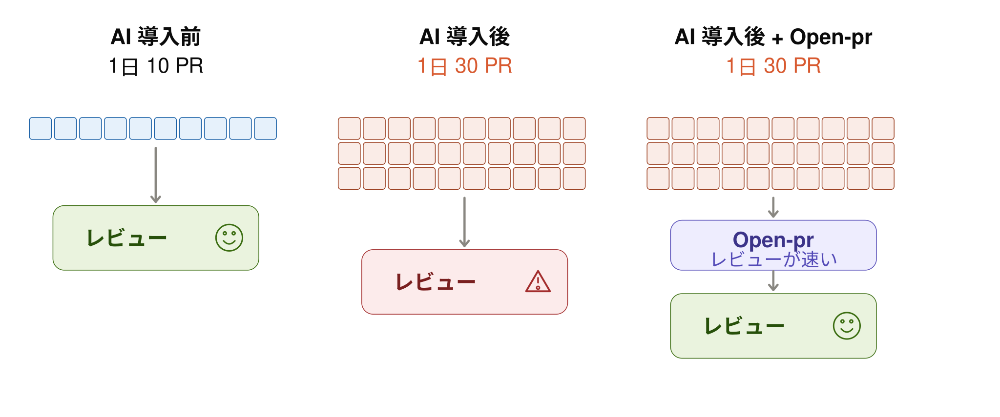
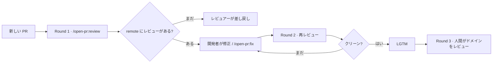

<p align="center">
  <picture>
    <source media="(prefers-color-scheme: dark)" srcset="./docs/images/logo/logo-lockup-dark.svg?v=moth1">
    
  </picture>
</p>

<p align="center">
  <strong>AI コードレビューを、あなたの PR に直接。</strong><br>
  <strong>オープンソース。セルフホスト。</strong><br>
  <sub>対応: <picture><source media="(prefers-color-scheme: dark)" srcset="./docs/images/icon/github-dark.png"></picture>&nbsp;GitHub · &nbsp;GitLab · &nbsp;Bitbucket</sub><br>
  <code>/open-pr:review</code> · <code>/open-pr:fix</code>
</p>

<p align="center">
  <a href="https://github.com/TOMOSIA-VIETNAM/open-pr/releases"></a>
  <a href="./LICENSE"></a>
  <a href="https://github.com/hashgraph-online/awesome-ai-plugins#development--workflow"></a>
  <a href="#インストール"></a>
  <a href="#インストール"></a>
  <a href="#インストール"></a>
</p>

<p align="center">
  <a href="#インストール"></a>
  <a href="#インストール"></a>
  <a href="#インストール"></a>
  <a href="#インストール"></a>
  <a href="#インストール"></a>
</p>

<p align="center">
  <a href="./README.vi-VN.md">Tiếng Việt</a> · <a href="./README.md">English</a> · <strong>日本語</strong> · <a href="./README.zh-Hans.md">简体中文</a>
</p>

AI コーディングで PR は速くなりました。でもレビューは速くなっていません。

**`open-pr` はその最初のレビューラウンドを、ローカルではなく PR 上で実行します。** PR を開いた人なら誰でも、同じフィードバックを見られます。

<p align="center">
  <a href="./docs/ja-JP/demo.md"></a>
</p>

1 回の実行で、結びついた 3 つの要素が出ます: **overview**、**行コメント**（suggested change 付き）、そして `/open-pr:fix` が push したあとの **返信**。 — [デモを見る](./docs/ja-JP/demo.md)

- 🔍 **1 回の実行でちょうど 1 件のレビュー** — bot コメントの垂れ流しではありません
- 🧠 **リポジトリを学ぶ** — README / CLAUDE.md / AGENTS.md / docs / wiki を読み、**チームのルールが汎用ルールに優先**
- 💬 **チームが言ったことを記憶** — ある PR での指摘が、次の実行に引き継がれます
- 🔧 **`/open-pr:fix` は規律を守る** — ちょうど **1** コミット、force-push なし、スレッドごとに返信
- 🔓 **オープンソース、`open-pr` のサービス不要** — MIT ライセンス。`open-pr` のサーバーも bot アカウントも不要で、いま使っている agent CLI 上で動きます

## Awesome AI Plugins に掲載されています

`open-pr` は、Hashgraph Online がキュレーションするクロスプラットフォームのカタログ [Awesome AI Plugins](https://github.com/hashgraph-online/awesome-ai-plugins#development--workflow) の *Community Plugins → Development & Workflow* に掲載され、[HOL Plugin Registry](https://hol.org/registry/plugins) に取り込まれています。レジストリは掲載された全プロジェクトをスキャンし、trust score を公開します。

掲載の条件はそのスキャン結果です: **score 80 以上、high / critical の finding なし**。スキャンはカタログ側が、このリポジトリのデフォルトブランチに対して自ら実行するもので、当方の自己申告ではありません。スキャンは信頼の目安であって、安全の保証ではありません。

## インストール

**1. ベンダーの CLI にログイン。** プラグイン自体は credential を持たず、*あなたの*アカウントで PR を読み、レビューを投稿します:

```bash
# GitHub
brew install gh          # または https://cli.github.com/
gh auth login            # GitHub.com → HTTPS → Login with a web browser
gh auth status           # "Logged in to github.com as <you>" と出れば OK
```

GitLab は `brew install glab && glab auth login --hostname gitlab.com`。Bitbucket に CLI はなく、環境変数 `BITBUCKET_EMAIL` + `BITBUCKET_API_TOKEN` を読みます。最小権限と確認方法: [ベンダーごとのトークン取得](./docs/ja-JP/credentials.md)。

**2. プラグイン。** [Claude Code](https://claude.ai/code):

```bash
/plugin marketplace add TOMOSIA-VIETNAM/open-pr
/plugin install open-pr@open-pr
```

**Cursor・Codex・Gemini CLI・Antigravity へのインストール:**

```bash
curl -fsSL https://raw.githubusercontent.com/TOMOSIA-VIETNAM/open-pr/main/install.sh | bash
```

詳細ガイド: [インストール](./docs/ja-JP/install.md) · [ベンダーごとのトークン取得](./docs/ja-JP/credentials.md)。

PR URL の形式: GitHub `.../pull/<n>` · GitLab `.../-/merge_requests/<n>`（セルフホスト含む）· Bitbucket Cloud `.../pull-requests/<n>`。

## なぜレビューがボトルネックになるのか

<p align="center">
  <picture>
    <source media="(prefers-color-scheme: dark)" srcset="./docs/images/bottleneck/ja-dark.svg">
    
  </picture>
</p>

AI コーディングの時代、PR の出る速さはレビューの速さを大きく上回っています。ボトルネックはもうコーディングではなく、**レビュー工程**にあります。レビュアーはプロジェクトの convention / security / performance を確認しつつ、ビジネスロジックもカバーしなければなりません — PR の量が増えるほど、このやり方はスケールしません。

ローカルでのレビューは信じにくい。誰でも *"レビュー済み"* と言えます。だから `open-pr` はそのステップを **remote** に移して可視化します — コメントは PR 上にあり、開いた人なら誰でも見られます。

> [!NOTE]
> **レビューラウンド**（チームへの提案）:
> 1. **Round 1** — 開発者が自分の PR で AI レビューを実行。レビューコメントがまだない → レビュアーは **差し戻し**、触れない。
> 2. **Round 2** — レビュアーが再度実行（AI）。クリーン → **LGTM**。
> 3. **Round 3** — レビュアーがドメイン部分をレビュー。

> [!IMPORTANT]
> AI はプロセス上の負荷を減らしますが、**最終責任はあなたにあります**。

## 汎用レビュースキルとの違い

多くのレビュースキルは `SKILL.md` の説明ファイルだけです。実行のたびに出方が変わり — 言い回しが違い、厳しさが違い、プロジェクトの convention からずれやすい。

| 汎用スキルでありがちなこと | `open-pr` では |
| --- | --- |
| 指摘が一般論にとどまり、プロジェクトとずれる | README / CLAUDE.md / AGENTS.md / docs / wiki を読む; **チームルールが**一般ルールに**勝つ** |
| 一度注意しても、次回また同じことをする | チャットでの指摘 → リポジトリの memory に書く許可を求める → 次回から自動適用 |
| 直せと言われたらコメントどおり直す — 間違ったコメントでも → 正しかったコードが壊れる | `/open-pr:fix` がコメントの妥当性を判断; 妥当でなければ **返信 + 根拠**、コードには触らない |
| 修正がコミット乱発・amend・force-push、返信なし | `fix` ごとにちょうど **1 コミット**、履歴は書き換えず、push 後に各コメントへ返信 |

> [!TIP]
> いちばん残したい点: いつ実行しても手順は同じ — convention を bootstrap し、リポジトリに合わせて出力言語を選び、チームが注意したことを memory に残す。今日は AI の口調がこう、明日は別、にはなりません。

## レビューフロー



再レビュー、worktree、`fix` 前のガードの詳細: [再レビュー / fix のフロー](./docs/ja-JP/how-it-works.md)。

## コマンド

| コマンド | 何をするか |
| --- | --- |
| `/open-pr:review <PR_URL>` | ちょうど **1** 件のレビューを投稿。コードは変更せず、close も merge もしない。リポジトリでの初回はセットアップも行う |
| `/open-pr:fix <PR_URL>` | finding を読む → 正誤を判断 → 修正 → **1** コミット → 返信。🔵 / 📝 は必ず先に確認 |
| `/open-pr:upgrade` | ローカル設定を現在の schema へ上げる — 要約してから確認; 同意するまで何も書かない |
| `/open-pr:clean` | `review` がチェックアウトした worktree を削除（先に確認）。memory / settings には触れない |
| `/open-pr:feedback` | **このプラグイン自体**の問題を issue tracker に報告。あなたのリポジトリを特定できる情報は取り除き、送信前に本文を確認してもらう |

> [!WARNING]
> `fix` はリポジトリ（またはレビュー worktree）の **実コード** を編集します。コメントを処理させたいと自分で決めたときだけ実行してください。

全設定: [設定](./docs/ja-JP/configuration.md)。

## 何をレビューするか

1. **バグ & ロジック**
2. **セキュリティ**
3. **パフォーマンス**
4. **コード品質**
5. **保守性 & 可読性**
6. **フレームワーク / 言語固有** — そのスタックのテンプレートに沿う

観点の詳細と競合時の優先順位: [何をレビューするか](./docs/ja-JP/review-criteria.md)。

## プロンプトトークンのグラフ

1 回の実行あたりの平均トークン数 — *happy-case* と *bad-case* の両方を含む:


---

Contribute? [CONTRIBUTING.md](./CONTRIBUTING.md)。

Enjoy reviewing 🥰

<p align="center">
  <picture>
    <source media="(prefers-color-scheme: dark)" srcset="./docs/images/logo/logo-dark.svg?v=moth1">
    
  </picture>
</p>

<p align="center">
  <sub>ロゴ一式: <a href="./docs/ja-JP/logo.md">docs/ja-JP/logo.md</a></sub>
</p>
