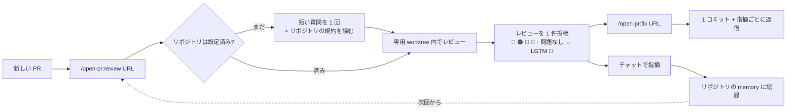
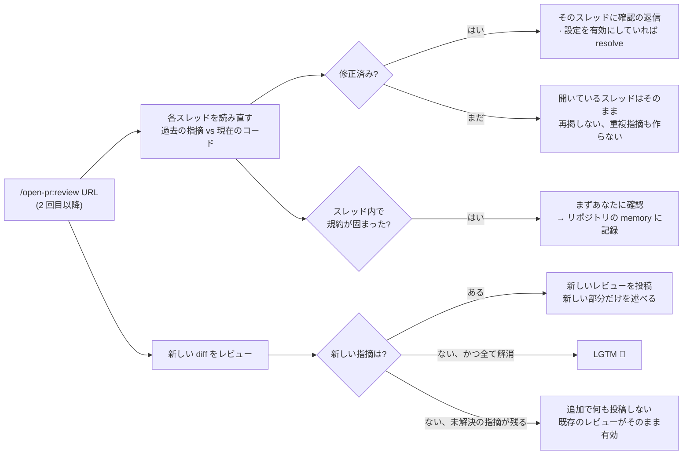
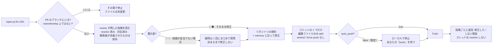

<p align="center">
  
</p>

<h1 align="center">Open PullRequest</h1>

<p align="center"><em>/open-pr:review — Agent Review Pull/Merge Request · GitHub · GitLab</em></p>

<p align="center">
  <a href="https://github.com/TOMOSIA-VIETNAM/open-pr/releases"></a>
  <a href="./LICENSE"></a>
  <a href="https://claude.ai/code"></a>
</p>

<p align="center">
  <a href="./README.vi.md">Tiếng Việt</a> · <a href="./README.md">English</a> · <strong>日本語</strong>
</p>

> PR が届いたとき最初に浮かぶ問いは、たいてい「このコードは正しいか」ではなく「開発者は送る前に一度でも
> 読み返したか」です。

`open-pr` はそこに向けて作られました。リポジトリに既にある規約に沿って PR をレビューし、あなたが指摘した
ことを記憶し、毎回同じ手順を通る Claude Code プラグインです — 同じトーン、同じ重大度の分け方、同じ形の
痕跡を PR に残します。

**GitHub**（`.../pull/<n>`）と **GitLab**（`.../-/merge_requests/<n>`、セルフホスト含む）に対応。

## 汎用のレビュースキルでは足りない理由


| よくあること                                             | `open-pr`                                                                                        |
| -------------------------------------------------------- | ------------------------------------------------------------------------------------------------ |
| 開発者が自分で見直したかどうか分からない                 | 開発者が自分の PR で `/open-pr:review` を実行すれば、レビュアーは会話を見るだけで分かる          |
| 些細な不備や基本的な業務ロジックの誤りにレビュー時間を取られる | AI が先にレビューし、痕跡を公開で残す。最終判断はレビュアーだが、出発点は片付いた状態      |
| 指摘が一般論にとどまり、プロジェクトの規約とずれる       | リポジトリの README/CLAUDE.md/AGENTS.md/docs/wiki を読み、チームのルールが一般論に勝つ           |
| 一度伝えても次回また同じことを言われる                   | チャットで指摘 → そのリポジトリの memory に書く許可を求める → 次回から自動で適用                |
| 古い・矛盾したドキュメントに誰も気づかない               | 定期的に規約ドキュメントを読み直し、合わなくなった点を挙げる                                     |
| 修正はコミット乱発・amend・force-push、返信なし          | 1 回の実行で 1 コミット、履歴は書き換えず、push 後に各コメントへ返信                            |
| 自前の `gh cli` プロンプトは毎回ばらつく                 | 手順・トーン・重大度の分け方が毎回同じ                                                          |


## 動きかた



`review` は PR のコードを専用の git worktree にチェックアウトするため、作業中のブランチには一切触れません
— レビュー中もそのまま開発を続けられます。さらに PR が変更した箇所だけでなく、その周辺のロジックも視野に
入れるので、diff の外にある deadcode や業務ロジックのバグも見逃しません。スコープ外だが影響のあるものは、
必ず直すべき指摘ではなく判断材料としてのアドバイスで返します。

開発者が修正または返信したあと、同じ PR でもう一度 `/open-pr:review` を実行しても、ゼロからやり直すのでは
なく前回の続きから進みます:



スレッド内で固まった規約は、勝手に覚えるのではなく必ずあなたに確認します。コメント上のルールは誰でも
書けるからです。

`/open-pr:fix` は逆方向に進みます。`review` が残した指摘そのものを読み、実際のコードを修正します:



`review` と違い worktree は **使わず**、ディスク上の実リポジトリを直接編集します。だからファイルに触れる
前に、これから編集する場所を確認します — ブランチ違い、`main`/`develop` 上、あるいは `review` が作った
worktree の中（detached でブランチがない）なら、いずれもその場で停止します。

## インストール

```bash
/plugin marketplace add TOMOSIA-VIETNAM/open-pr
/plugin install open-pr@review-pr
```

更新:

```bash
/plugin marketplace update review-pr
/plugin update open-pr@review-pr
/reload-plugins
/open-pr:upgrade
```

`/open-pr:upgrade` はリポジトリのローカル設定を新しいビルドと突き合わせます。変更が必要なら内容を要約して
確認を取り、同意するまで何も書きません。変更がなければ「最新です」と伝えて終了します。

必要なもの: [Claude Code](https://claude.ai/code)、および [`gh`](https://cli.github.com/)（GitHub の PR）
または [`glab`](https://gitlab.com/gitlab-org/cli)（GitLab の MR）にログイン済み — レビューはそのアカウント
で投稿されます。

## 使い方


| コマンド                | 何をするか                                                                                                       | 実行時にどこにいるか                                                              | 何を書くか                                            |
| ----------------------- | ---------------------------------------------------------------------------------------------------------------- | --------------------------------------------------------------------------------- | ----------------------------------------------------- |
| `/open-pr:review <URL>` | PR をレビューし、レビューを **1** 件だけ投稿（概要＋行コメント）。コードは変更せず、close も merge もしない       | リポジトリを含むワークスペース内（推奨）、またはリポジトリ内 — `git remote` で自動判別 | PR 上のコメント + `notebooks/review/<repo>/` の memory |
| `/open-pr:fix <URL>`    | 前回のレビューの指摘を読み、コードを修正し、**1** コミットにまとめ、各コメントへ返信。🔵/📝 は必ず事前に確認     | そのリポジトリ内、またはそれを含むワークスペース内 — ただし **リポジトリが PR のブランチ上にあること** | そのリポジトリの実コード + PR への返信 |
| `/open-pr:upgrade`      | リポジトリのローカル設定を最新スキーマへ更新。変更点を要約して確認し、同意するまで何も書かない                   | 設定済みのワークスペースまたはリポジトリ内 — 複数あれば選択させる                  | `notebooks/review/<repo>/settings.json`               |


コマンドは自分で入力したときだけ実行され、submodule にも対応します。URL の後ろに書いた指示は、その実行に
だけ適用されます:

```bash
/open-pr:review https://github.com/org/repo/pull/123 [指示]
/open-pr:fix    https://github.com/org/repo/pull/123 [指示]
```

### セットアップはワークスペースで、リポジトリの中ではなく

```
✅ ワークスペースにいる                      ❌ リポジトリの中にいる
─────────────────────────                    ─────────────────────────
workspace/            ← ここで入力           repo-backend/         ← ここで入力
├── notebooks/review/  memory + worktree     ├── notebooks/review/  memory がプロジェクト内に入る
│   ├── repo-backend/  どのリポジトリの外    ├── .gitignore         +1 行 — 実際の変更
│   └── repo-frontend/                       └── src/
├── repo-backend/     ← 余計なファイル 0
└── repo-frontend/    ← 余計なファイル 0     (repo-frontend? 見えない)
```

`notebooks/review/`（memory + worktree）は、コマンドを入力した場所にそのまま作られます。リポジトリの中で
入力すればプロジェクト内に置かれます。プラグインが `.gitignore` に 1 行追加するので `git status` は汚れ
ませんが、その 1 行はリポジトリへの実際の変更です。

ワークスペースから実行すればリポジトリには一切触れません。さらにリポジトリが横に並んでいるため、リポジトリ
をまたいだレビューができます — 1 つの機能に属する複数の PR を、並列ではなく順番に 1 回の実行で。
`repo-backend` の中からは `repo-frontend` は見えません:

```bash
cd ~/workspace
/open-pr:review https://github.com/org/repo-backend/pull/12 https://github.com/org/repo-frontend/pull/34
```

`/open-pr:fix` もワークスペースから実行できます。対象リポジトリを自分で見つけてその中で修正します
（そのリポジトリが PR のブランチ上にあることが条件）。


## 何をレビューするか


| #   | 観点                    | 見るところ                                                                                                                                      |
| --- | ----------------------- | ----------------------------------------------------------------------------------------------------------------------------------------------- |
| 1   | **バグ & ロジック**     | 見て取れるロジック誤り、エッジケース（空/null/境界）、条件分岐とエラー経路が処理されているか                                                    |
| 2   | **セキュリティ**        | ハードコードされた秘密情報、検証なしの入力が query/command/render へ直行、重要な操作での権限チェック漏れ                                        |
| 3   | **パフォーマンス**      | キャッシュや batch にすべき API/DB 呼び出し・計算の繰り返し、stream せずに大きなデータセットを丸ごとロード                                      |
| 4   | **コード品質**          | 命名がプロジェクトの規約に沿っているか、重複コード、1 つの unit が抱えすぎ、残骸（コメントアウトされた塊、未使用の flag/import、削除済みタスクを指す TODO） |
| 5   | **保守性 & 可読性**     | 自明でないロジックにコメントがあり現状を正しく述べているか（過去の経緯を語らない）、テストが happy path と error path の両方を覆うか、次の変更の余地が残る設計か |


**6 番目の観点**はフレームワーク/言語に固有の部分で、スタックごとのテンプレートが担います: Rails、Vue、
React、Python、Node.js、Lambda、PHP、Laravel、WordPress、Shell、Makefile、そして AI エージェント向けの
指示として書かれた markdown。未知のスタックに出会えば、その場でテンプレートを書きます。

競合したときの優先順位: チームのルール → 学習済みの memory → スタックのテンプレート → 上記 5 観点。
チームのルールが常に勝ちます。

## リポジトリでの初回実行

リポジトリごとに 1 度だけ、短い質問をまとめて訊きます（PR に投稿する言語、即投稿かドラフトか、修正済み
スレッドを自動 resolve するか、ドキュメントを読み直す間隔、大きすぎる PR/ファイルのしきい値）。その後、
すでにある規約を自分で読みに行きます: README、CLAUDE.md、AGENTS.md、docs、wiki など。

記憶した内容は `notebooks/review/<repo>/memory.md` に目次のようにインデックスされます。詳細を読み込まずに
済むのでトークンを節約でき、それでも何を学んだかの全体像は把握できます。詳細は
`notebooks/review/<repo>/memories/*.md` に 1 件ずつ保存されます。`notebooks/review/` 全体は独立した
ローカル git で管理され（remote なし、push もしない）、レビューごとの memory の変化を追えます。

チーム独自のルールは普通の文章で `ALWAYS_RULE.md` に書きます（初期状態は空）。それ以外は
`settings.json` にあります:


| Field                                | 意味                                                                                      | 既定値               |
| ------------------------------------ | ----------------------------------------------------------------------------------------- | -------------------- |
| `shared.chat_language`               | チャットで使う言語                                                                        | 自動判別             |
| `shared.output_language`             | PR に投稿する言語                                                                         | 初回に質問して保存   |
| `review.auto_submit_review`          | `true` = すぐ投稿、`false` = ドラフトにして確認できるようにする                           | `false`              |
| `review.auto_resolve_fixed_findings` | 指摘が修正されたらスレッドを自動 resolve                                                  | `false`              |
| `review.doctor_schedule`             | 規約ドキュメントを読み直す間隔: `"{N} days"` \| `"{N} weeks"` \| `"{N} months"` \| `"never"` | `"1 months"`       |
| `review.review_ci_status`            | CI が失敗している場合に触れるか（警告のみ、修正は強制しない）                             | CI あり ⇒ `true`     |
| `review.many_files_threshold`        | この数を超えるファイル数の PR は大きすぎると警告                                          | `30`                 |
| `review.big_file_threshold_kb`       | diff がこのサイズを超えるファイルは最初の読み取りから除外                                 | `20`                 |
| `fix.decline_needs_confirmation`     | 指摘を見送る前にあなたへ確認する                                                          | `true`               |
| `fix.auto_push`                      | コミット後に自動で push する                                                              | `false`              |


---

Happy Coding 🌟
