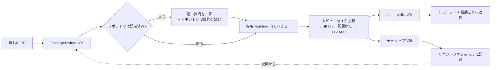

<p align="center">
  
</p>

<h1 align="center">Open PullRequest</h1>

<p align="center"><em>/open-pr:review — Agent Review Pull/Merge Request · GitHub · GitLab</em></p>

<p align="center">
  <a href="https://github.com/TOMOSIA-VIETNAM/open-pr/releases"></a>
  <a href="./LICENSE"></a>
  <a href="https://claude.ai/code"></a>
</p>

<p align="center">
  <a href="./README.vi.md">Tiếng Việt</a> · <a href="./README.md">English</a> · <strong>日本語</strong>
</p>

> PR が届いたとき最初に浮かぶ問いは、たいてい「このコードは正しいか」ではなく「開発者は送る前に一度でも
> 読み返したか」です。

`open-pr` はそこに向けて作られました。リポジトリに既にある規約に沿って PR をレビューし、あなたが指摘した
ことを記憶し、毎回同じ手順を通る Claude Code プラグインです — 同じトーン、同じ重大度の分け方、同じ形の
痕跡を PR に残します。

**GitHub**（`.../pull/<n>`）と **GitLab**（`.../-/merge_requests/<n>`、セルフホスト含む）に対応。

## 汎用のレビュースキルでは足りない理由

| よくあること                                             | `open-pr`                                                                                        |
| -------------------------------------------------------- | ------------------------------------------------------------------------------------------------ |
| 開発者が自分で見直したかどうか分からない                 | 開発者が自分の PR で `/open-pr:review` を実行すれば、レビュアーは会話を見るだけで分かる          |
| 指摘が一般論にとどまり、プロジェクトの規約とずれる       | リポジトリの README/CLAUDE.md/AGENTS.md/docs/wiki を読み、チームのルールが一般論に勝つ           |
| 一度伝えても次回また同じことを言われる                   | チャットで指摘 → そのリポジトリの memory に書く許可を求める → 次回から自動で適用                |
| 修正はコミット乱発・amend・force-push、返信なし          | 1 回の実行で 1 コミット、履歴は書き換えず、push 後に各コメントへ返信                            |

## 動きかた



全体のフロー、再レビュー、そして `fix` がファイルに触れる前に行う確認: [動きかた](./docs/ja/how-it-works.md)。

### 出てくるもの

1 件のレビューに 3 つの要素が揃います。Overview、修正後のコードを添えた該当行へのコメント、そして push
後に `fix` が同じスレッドへ残す返信です。

<a href="./docs/ja/demo.md"></a>

フルサイズと、各リポジトリが選んだ言語での同じレビュー:
[レビューの見え方](./docs/ja/demo.md)。

## インストール

[Claude Code](https://claude.ai/code):

```bash
/plugin marketplace add TOMOSIA-VIETNAM/open-pr
/plugin install open-pr@open-pr
```

Cursor・Codex・Gemini CLI・Antigravity:

```bash
curl -fsSL https://raw.githubusercontent.com/TOMOSIA-VIETNAM/open-pr/main/install.sh | bash
```

アンインストール・更新・プラットフォーム別のコマンド: [インストール](./docs/ja/install.md)。

## 使い方

| コマンド | 何をするか |
| -------- | ---------- |
| `/open-pr:review <URL>` | PR をレビューし、レビューを **1** 件だけ投稿（概要＋行コメント）。コードは変更せず、close も merge もしない。リポジトリでの初回はセットアップも行う |
| `/open-pr:fix <URL>` | review が残した指摘を読み、コードを修正して **1** コミットにまとめ、各コメントへ返信。リポジトリ内でもレビュー worktree 内でも動き、後者では URL 省略可。🔵/📝 は必ず事前に確認 |
| `/open-pr:upgrade` | リポジトリのローカル設定を現在のスキーマへ更新。変更点を要約して確認し、同意するまで何も書かない |
| `/open-pr:clean` | `review` が PR のコードをチェックアウトした worktree を削除 — 1 つずつが完全なチェックアウトでディスクを使う。サイズ付きで一覧し先に確認する。memory と設定には触れない |

どこに立つか、各コマンドが何を書くか、すべての設定: [設定](./docs/ja/configuration.md)。

## 何をレビューするか

1. **バグ & ロジック**
2. **セキュリティ**
3. **パフォーマンス**
4. **コード品質**
5. **保守性 & 可読性**
6. **フレームワーク/言語に固有の観点** — そのスタック自身のテンプレートが持つ

チームのルールは 6 つすべてに優先します。

各観点の詳細と、競合したときの優先順位:
[何をレビューするか](./docs/ja/review-criteria.md)。

## リリースごとのコンテキストコスト


---

Enjoy reviewing 🥰
