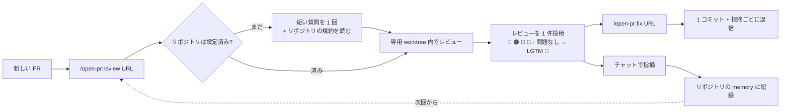

<p align="center">
  
</p>

<h1 align="center">Open PullRequest</h1>

<p align="center"><em>/open-pr:review — Agent Review Pull/Merge Request · GitHub · GitLab</em></p>

<p align="center">
  <a href="https://github.com/TOMOSIA-VIETNAM/open-pr/releases"></a>
  <a href="./LICENSE"></a>
  <a href="https://claude.ai/code"></a>
</p>

<p align="center">
  <a href="./README.vi.md">Tiếng Việt</a> · <a href="./README.md">English</a> · <strong>日本語</strong>
</p>

> PR が届いたとき最初に浮かぶ問いは、たいてい「このコードは正しいか」ではなく「開発者は送る前に一度でも
> 読み返したか」です。

`open-pr` はそこに向けて作られました。リポジトリに既にある規約に沿って PR をレビューし、あなたが指摘した
ことを記憶し、毎回同じ手順を通る Claude Code プラグインです — 同じトーン、同じ重大度の分け方、同じ形の
痕跡を PR に残します。

**GitHub**（`.../pull/<n>`）と **GitLab**（`.../-/merge_requests/<n>`、セルフホスト含む）に対応。

## 汎用のレビュースキルでは足りない理由

| よくあること                                             | `open-pr`                                                                                        |
| -------------------------------------------------------- | ------------------------------------------------------------------------------------------------ |
| 開発者が自分で見直したかどうか分からない                 | 開発者が自分の PR で `/open-pr:review` を実行すれば、レビュアーは会話を見るだけで分かる          |
| 指摘が一般論にとどまり、プロジェクトの規約とずれる       | リポジトリの README/CLAUDE.md/AGENTS.md/docs/wiki を読み、チームのルールが一般論に勝つ           |
| 一度伝えても次回また同じことを言われる                   | チャットで指摘 → そのリポジトリの memory に書く許可を求める → 次回から自動で適用                |
| 修正はコミット乱発・amend・force-push、返信なし          | 1 回の実行で 1 コミット、履歴は書き換えず、push 後に各コメントへ返信                            |

## 動きかた



全体のフロー、再レビュー、そして `fix` がファイルに触れる前に行う確認: [動きかた](./docs/ja/how-it-works.md)。

## インストール

```bash
/plugin marketplace add TOMOSIA-VIETNAM/open-pr
/plugin install open-pr@open-pr
```

更新:

```bash
/plugin marketplace update open-pr
/plugin update open-pr@open-pr
/reload-plugins
/open-pr:upgrade
```

`/open-pr:upgrade` はリポジトリのローカル設定を新しいビルドと突き合わせます。変更が必要なら内容を要約して
確認を取り、同意するまで何も書きません。変更がなければ「最新です」と伝えて終了します。

1.0.0 より前から使っている場合、マーケットプレイス名が `review-pr` から `open-pr` に変わったため一度だけ
入れ直してください — `/plugin uninstall open-pr`、`/plugin marketplace remove review-pr`、そのうえで上の
インストール 2 行。

必要なもの: [Claude Code](https://claude.ai/code)、および [`gh`](https://cli.github.com/)（GitHub の PR）
または [`glab`](https://gitlab.com/gitlab-org/cli)（GitLab の MR）にログイン済み — レビューはそのアカウント
で投稿されます。

## 使い方

| コマンド                | 何をするか                                                                                                       | 実行時にどこにいるか                                                              | 何を書くか                                            |
| ----------------------- | ---------------------------------------------------------------------------------------------------------------- | --------------------------------------------------------------------------------- | ----------------------------------------------------- |
| `/open-pr:review <URL>` | PR をレビューし、レビューを **1** 件だけ投稿（概要＋行コメント）。コードは変更せず、close も merge もしない       | リポジトリを含むワークスペース内（推奨）、またはリポジトリ内 — `git remote` で自動判別 | PR 上のコメント + `notebooks/review/<repo>/` の memory |
| `/open-pr:fix <URL>`    | 前回のレビューの指摘を読み、コードを修正し、**1** コミットにまとめ、各コメントへ返信。🔵/📝 は必ず事前に確認     | そのリポジトリ内、またはそれを含むワークスペース内 — ただし **リポジトリが PR のブランチ上にあること** | そのリポジトリの実コード + PR への返信 |
| `/open-pr:upgrade`      | リポジトリのローカル設定を最新スキーマへ更新。変更点を要約して確認し、同意するまで何も書かない                   | 設定済みのワークスペースまたはリポジトリ内 — 複数あれば選択させる                  | `notebooks/review/<repo>/settings.json`               |

コマンドは自分で入力したときだけ実行され、submodule にも対応します。URL の後ろに書いた指示は、その実行に
だけ適用されます:

```bash
/open-pr:review https://github.com/org/repo/pull/123 [指示]
/open-pr:fix    https://github.com/org/repo/pull/123 [指示]
```

## 何をレビューするか

どの PR でも 5 つの観点 — バグ & ロジック · セキュリティ · パフォーマンス · コード品質 · 保守性 — に加えて、スタック固有のテンプレートが持つ 6 番目の観点:
Rails、Vue、React、Python、Node.js、Lambda、PHP、Laravel、WordPress、Shell、Makefile、そして AI エージェント向けの指示として書かれた
markdown。未知のスタックにはその場でテンプレートを書き、チームのルールが常にすべてに優先します。

各観点の詳細と、競合したときの優先順位: [何をレビューするか](./docs/ja/review-criteria.md)。

## リポジトリでの初回実行

リポジトリごとに 1 度だけ、短い質問をまとめて訊きます（PR に投稿する言語、即投稿かドラフトか、修正済み
スレッドを自動 resolve するか、ドキュメントを読み直す間隔、大きすぎる PR/ファイルのしきい値）。その後、
すでにある規約を自分で読みに行きます: README、CLAUDE.md、AGENTS.md、docs、wiki など。

memory の置き場所と、すべての設定とその既定値: [設定](./docs/ja/configuration.md)。

## リリースごとのコンテキストコスト


---

Enjoy reviewing 🥰
