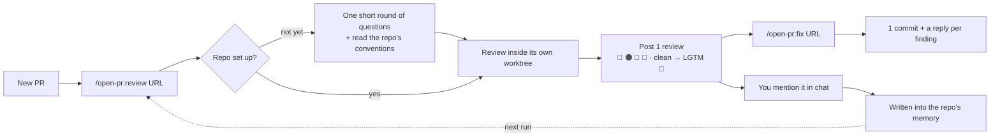

<p align="center">
  
</p>

<h1 align="center">Open PullRequest</h1>

<p align="center"><em>/open-pr:review — Agent Review Pull/Merge Request · GitHub · GitLab</em></p>

<p align="center">
  <a href="https://github.com/TOMOSIA-VIETNAM/open-pr/releases"></a>
  <a href="./LICENSE"></a>
  <a href="https://claude.ai/code"></a>
</p>

<p align="center">
  <a href="./README.vi.md">Tiếng Việt</a> · <strong>English</strong> · <a href="./README.ja.md">日本語</a>
</p>

> When a PR lands, the first question in your head usually isn't "is this code correct", it's "did
the
> dev read it back even once before sending it".

`open-pr` exists for exactly that: a Claude Code plugin that reviews PRs against the conventions
your
repo already has, remembers what you tell it, and goes through the same procedure every run — same
tone, same severity scale, same trail left on the PR.

Works with **GitHub** (`.../pull/<n>`) and **GitLab** (`.../-/merge_requests/<n>`, self-hosted
included).

## Why not just a generic review skill?

| What usually happens                                          | `open-pr`                                                                                       |
| ------------------------------------------------------------- | ----------------------------------------------------------------------------------------------- |
| No way to tell whether the dev reviewed their own PR          | The dev runs `/open-pr:review` on their own PR; a reviewer sees it right in the conversation     |
| Advice at the level of generic rules, off the project's conventions | Reads the repo's README/CLAUDE.md/AGENTS.md/docs/wiki, and team rules beat every generic one |
| You say it once, next time it's the same again                 | You mention it in chat → it asks to write it into that repo's memory → next run applies it      |
| Fixes arrive as commit spam, amends, force-pushes, no replies   | Exactly 1 commit per run, no history rewriting, and a reply on every comment once pushed        |

## How it runs



Full flow, re-review, and the check `fix` makes before it touches a file:
[How it works](./docs/how-it-works.md).

### What comes out

One review, three parts that belong together: the overview, a comment on the exact line with the
corrected code, and the reply `fix` leaves on that same thread once the change is pushed.

<a href="./docs/demo.md"></a>

Full size, and the same review in the language each repo picks:
[What a review looks like](./docs/demo.md).

## Install

[Claude Code](https://claude.ai/code):

```bash
/plugin marketplace add TOMOSIA-VIETNAM/open-pr
/plugin install open-pr@open-pr
```

Cursor, Codex, Gemini CLI, Antigravity:

```bash
curl -fsSL https://raw.githubusercontent.com/TOMOSIA-VIETNAM/open-pr/main/install.sh | bash
```

Uninstall, update, per-platform commands: [Install](./docs/install.md).

## Usage

| Command | What it does |
| ------- | ------------ |
| `/open-pr:review <URL>` | Reviews the PR and posts exactly **1** review: overview + line-by-line comments. Never edits code, never closes, never merges. The first run in a repo also sets it up |
| `/open-pr:fix <URL>` | Reads the findings that review left, fixes the code, wraps it in **1** commit, then replies per comment. Runs in the repo or in the review worktree, where the URL is optional. 🔵/📝 always ask you first |
| `/open-pr:upgrade` | Brings a repo's local config up to the current schema. Summarises what changes and asks; nothing is written until you agree |
| `/open-pr:clean` | Removes the worktrees `review` checked PR code out into — each is a full checkout on disk. Lists them with their size and asks first; memory and settings are never touched |

Where to stand, what each command writes, every setting: [Configuration](./docs/configuration.md).

## What it reviews

1. **Bugs & logic**
2. **Security**
3. **Performance**
4. **Code quality**
5. **Maintainability & readability**
6. **Framework/language-specific** — from that stack's own template

Your team's rules outrank all six.

Every criterion in detail, and the priority order when they conflict:
[What it reviews](./docs/review-criteria.md).

Contributing? See [CONTRIBUTING.md](./CONTRIBUTING.md).

## Context cost per release


---

Enjoy reviewing 🥰
