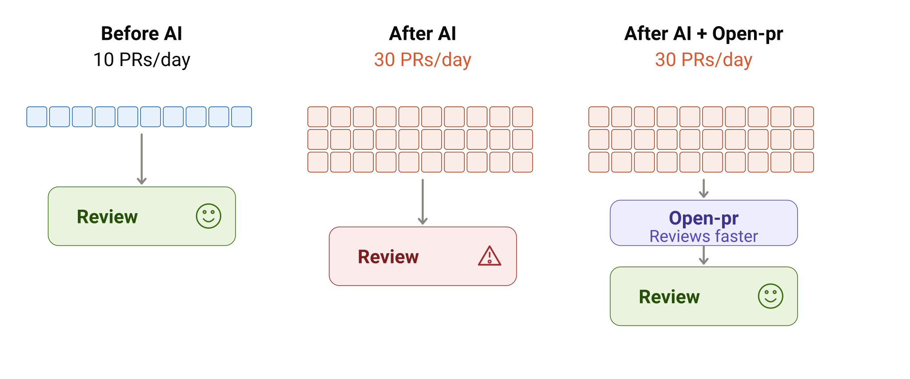
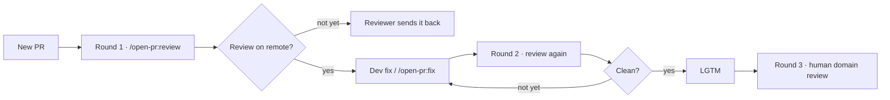

<p align="center">
  <picture>
    <source media="(prefers-color-scheme: dark)" srcset="./docs/images/logo/logo-lockup-dark.svg?v=moth1">
    
  </picture>
</p>

<p align="center">
  <strong>AI code review that lands directly on your PR.</strong><br>
  <strong>Open source. Self-hosted.</strong><br>
  <sub>Works with <picture><source media="(prefers-color-scheme: dark)" srcset="./docs/images/icon/github-dark.png"></picture>&nbsp;GitHub · &nbsp;GitLab · &nbsp;Bitbucket</sub><br>
  <code>/open-pr:review</code> · <code>/open-pr:fix</code>
</p>

<p align="center">
  <a href="https://github.com/TOMOSIA-VIETNAM/open-pr/releases"></a>
  <a href="./LICENSE"></a>
  <a href="#install"></a>
  <a href="#install"></a>
  <a href="#install"></a>
</p>

<p align="center">
  <a href="#install"></a>
  <a href="#install"></a>
  <a href="#install"></a>
  <a href="#install"></a>
  <a href="#install"></a>
</p>

<p align="center">
  <a href="./README.vi-VN.md">Tiếng Việt</a> · <strong>English</strong> · <a href="./README.ja-JP.md">日本語</a> · <a href="./README.zh-Hans.md">简体中文</a>
</p>

AI coding made PRs faster. But review didn't get faster.

**`open-pr` runs that first review round for you — on the PR, not on your laptop.** Anyone who opens the PR sees the same feedback.

<p align="center">
  <a href="./docs/demo.md"></a>
</p>

One run produces three parts that belong together: an **overview**, **line comments** (with suggested changes), and a **reply** after `/open-pr:fix` has pushed. — [See the demo](./docs/demo.md)

- 🔍 **Exactly 1 review per run** — one review posted, not a stream of bot comments
- 🧠 **Learns your repo** — README / CLAUDE.md / AGENTS.md / docs / wiki; team rules beat generic rules
- 💬 **Remembers what the team said** — a correction on one PR carries into the next run
- 🔧 **`/open-pr:fix` is disciplined** — exactly **1** commit, no force-push, a reply on every thread
- 🔓 **Open source, no `open-pr` service** — MIT-licensed, no `open-pr` server or bot account; it runs in the agent CLI you already have

## Install

**1. A vendor CLI, logged in.** The plugin carries no credential of its own — it reads the PR and posts the review through *your* account:

```bash
# GitHub
brew install gh          # or https://cli.github.com/
gh auth login            # GitHub.com → HTTPS → Login with a web browser
gh auth status           # must say "Logged in to github.com as <you>"
```

GitLab: `brew install glab && glab auth login --hostname gitlab.com`. Bitbucket ships no CLI — it reads `BITBUCKET_EMAIL` + `BITBUCKET_API_TOKEN` from the environment. Minimum permissions and how to check them: [Getting a token per vendor](./docs/credentials.md).

**2. The plugin.** [Claude Code](https://claude.ai/code):

```bash
/plugin marketplace add TOMOSIA-VIETNAM/open-pr
/plugin install open-pr@open-pr
```

**Install for Cursor, Codex, Gemini CLI, Antigravity:**

```bash
curl -fsSL https://raw.githubusercontent.com/TOMOSIA-VIETNAM/open-pr/main/install.sh | bash
```

Full guide: [Install](./docs/install.md) · [Getting a token per vendor](./docs/credentials.md).

PR URL formats: GitHub `.../pull/<n>` · GitLab `.../-/merge_requests/<n>` (self-hosted included) · Bitbucket Cloud `.../pull-requests/<n>`.

## Why review is the bottleneck

<p align="center">
  <picture>
    <source media="(prefers-color-scheme: dark)" srcset="./docs/images/bottleneck/en-dark.svg">
    
  </picture>
</p>

In the age of AI coding, PRs ship far faster than they get reviewed. The bottleneck is no longer coding — it's **review**. Reviewers have to check the project's conventions / security / performance *and* cover business logic — and that doesn't scale well as PR volume grows.

A local review is hard to trust. Anyone can say *"I already reviewed it"*. So `open-pr` moves that step to **remote** for transparency — comments sit on the PR, and anyone who opens it can see them.

> [!NOTE]
> **Review rounds** (a suggestion for the team):
> 1. **Round 1** — Dev runs AI review on the PR themselves. No review comments yet → reviewer **sends it back**, without touching it.
> 2. **Round 2** — Reviewer runs it again (AI). Clean → **LGTM**.
> 3. **Round 3** — Reviewer reviews the domain part.

> [!IMPORTANT]
> AI lightens the process load, but **final responsibility is still yours**.

## How it differs from a generic review skill

Many review skills are just a `SKILL.md` description. Each run comes out differently — different wording, different strictness, easy to drift from the project's conventions.

| Common with a generic skill | With `open-pr` |
| --- | --- |
| Advice stays at generic rules, off the project | Reads README / CLAUDE.md / AGENTS.md / docs / wiki; **team rules beat** generic rules |
| You remind it once, next time it slips again | Mentions in chat → asks to write into the repo's memory → next run applies it |
| Told to fix → fixes per the comment — even a wrong comment → correct code becomes wrong | `/open-pr:fix` weighs whether a comment is sound; if not → **reply + evidence**, no code change |
| Fixes arrive as commit spam, amends, force-pushes, no replies | Exactly **1 commit** per `fix`, no history rewriting, a reply per comment after push |

> [!TIP]
> The part worth keeping: no matter when you run it, the procedure is the same — bootstrap conventions, pick the output language from the repo, then remember what the team has reminded. Not one AI voice today and another tomorrow.

## Review flow



Details on re-review, worktrees, and the guard before `fix`: [Re-review / fix flow](./docs/how-it-works.md).

## Commands

| Command | What it does |
| --- | --- |
| `/open-pr:review <PR_URL>` | Posts exactly **1** review. No code edits, no close, no merge. First run in a repo also sets it up |
| `/open-pr:fix <PR_URL>` | Reads findings → weighs right/wrong → fixes → **1** commit → replies. 🔵 / 📝 always ask first |
| `/open-pr:upgrade` | Brings local config up to the current schema — summarises, then asks; nothing written until you agree |
| `/open-pr:clean` | Removes worktrees that `review` checked out (asks first). Memory / settings untouched |
| `/open-pr:feedback` | Reports a problem with **this plugin** on its issue tracker — stripped of anything identifying your repo, and shown to you before it is posted |

> [!WARNING]
> `fix` edits **real code** in the repo (or the review worktree). Run it only when you deliberately want it to handle the comments.

Full configuration: [Configuration](./docs/configuration.md).

## What it reviews

1. **Bugs & logic**
2. **Security**
3. **Performance**
4. **Code quality**
5. **Maintainability & readability**
6. **Framework / language-specific** — from that stack's template

Criteria in detail and priority when they conflict: [What it reviews](./docs/review-criteria.md).

## Prompt token chart

Mean tokens per run — covering both *happy-case* and *bad-case*:


---

Contributing? [CONTRIBUTING.md](./CONTRIBUTING.md).

Enjoy reviewing 🥰

<p align="center">
  <picture>
    <source media="(prefers-color-scheme: dark)" srcset="./docs/images/logo/logo-dark.svg?v=moth1">
    
  </picture>
</p>

<p align="center">
  <sub>Logo files: <a href="./docs/logo.md">docs/logo.md</a></sub>
</p>
