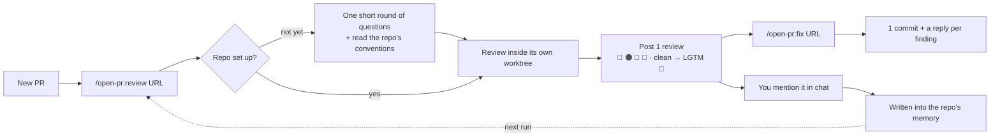
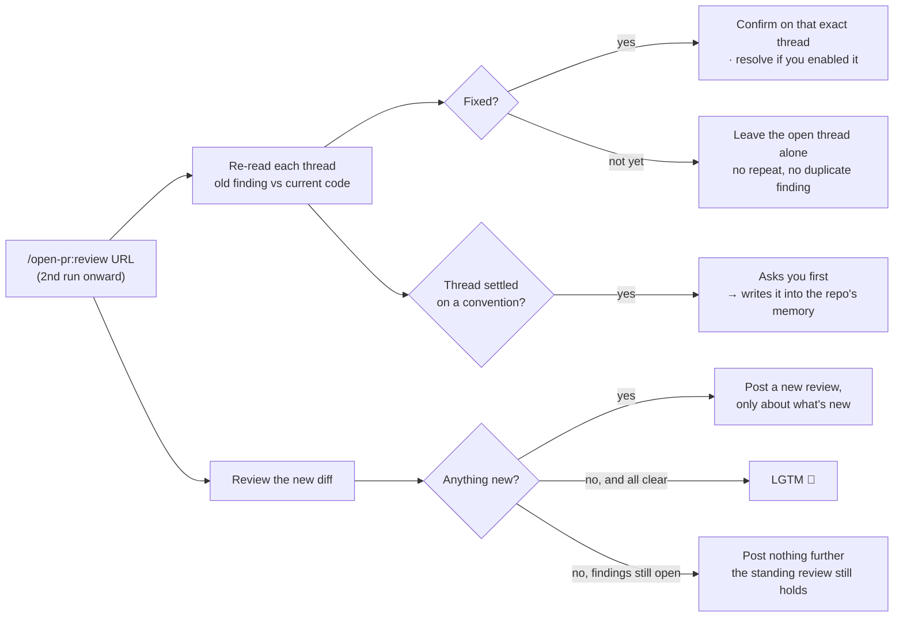
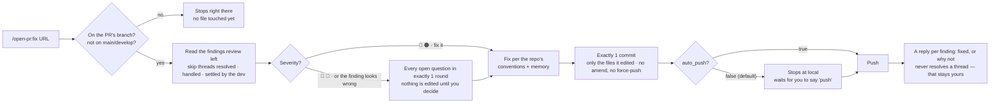

<p align="center">
  
</p>

<h1 align="center">Open PullRequest</h1>

<p align="center"><em>/open-pr:review — Agent Review Pull/Merge Request · GitHub · GitLab</em></p>

<p align="center">
  <a href="https://github.com/TOMOSIA-VIETNAM/open-pr/releases"></a>
  <a href="./LICENSE"></a>
  <a href="https://claude.ai/code"></a>
</p>

<p align="center">
  <a href="./README.vi.md">Tiếng Việt</a> · <strong>English</strong> · <a href="./README.ja.md">日本語</a>
</p>

> When a PR lands, the first question in your head usually isn't "is this code correct", it's "did the
> dev read it back even once before sending it".

`open-pr` exists for exactly that: a Claude Code plugin that reviews PRs against the conventions your
repo already has, remembers what you tell it, and goes through the same procedure every run — same
tone, same severity scale, same trail left on the PR.

Works with **GitHub** (`.../pull/<n>`) and **GitLab** (`.../-/merge_requests/<n>`, self-hosted
included).

## Why not just a generic review skill?


| What usually happens                                          | `open-pr`                                                                                       |
| ------------------------------------------------------------- | ----------------------------------------------------------------------------------------------- |
| No way to tell whether the dev reviewed their own PR          | The dev runs `/open-pr:review` on their own PR; a reviewer sees it right in the conversation     |
| Review time burned on small stuff and basic business slips    | AI reviews first and leaves a public trail; the reviewer still has the final word, but the starting point is already cleared |
| Advice at the level of generic rules, off the project's conventions | Reads the repo's README/CLAUDE.md/AGENTS.md/docs/wiki, and team rules beat every generic one |
| You say it once, next time it's the same again                 | You mention it in chat → it asks to write it into that repo's memory → next run applies it      |
| Outdated or conflicting docs, nobody notices                   | Re-reads the convention docs on schedule and raises whatever no longer matches                 |
| Fixes arrive as commit spam, amends, force-pushes, no replies   | Exactly 1 commit per run, no history rewriting, and a reply on every comment once pushed        |
| Hand-rolled `gh cli` prompts come out different every time      | Same procedure, same tone, same severity scale, every run                                      |


## How it runs



`review` checks the PR's code out into its own git worktree, so the branch you're on is never touched —
review and keep coding at the same time. And it doesn't only look at what the PR changed: the logic
around it is in scope too, so deadcode and business-logic bugs outside the diff don't slip past.
Anything out of scope that still matters comes back as advice for you to weigh, not as a finding you
must fix.

Type `/open-pr:review` again on the same PR after the dev has fixed or replied and it doesn't review
from scratch — it picks up where the last run left off:



A convention settled inside a thread is always confirmed with you rather than remembered on its own:
anyone can write a rule in a comment.

`/open-pr:fix` runs the other way: it reads the very findings `review` left, then edits real code:



Unlike `review` it uses **no** worktree: it edits the real repo on disk. So before touching any file it
checks the place it's about to edit — wrong branch, on `main`/`develop`, or inside the very worktree
`review` created (that one is detached, no branch) all stop it immediately.

## Install

```bash
/plugin marketplace add TOMOSIA-VIETNAM/open-pr
/plugin install open-pr@open-pr
```

Update:

```bash
/plugin marketplace update open-pr
/plugin update open-pr@open-pr
/reload-plugins
/open-pr:upgrade
```

`/open-pr:upgrade` compares the repo's local config against the new build. Anything that needs
changing is summarised and put to you first — nothing is written until you agree; nothing to change and
it says the config is already current, then stops.

Coming from a pre-1.0.0 install? The marketplace was renamed from `review-pr` to `open-pr`, so it is
re-added once — `/plugin uninstall open-pr`, `/plugin marketplace remove review-pr`, then the two install
commands above.

You also need: [Claude Code](https://claude.ai/code), plus [`gh`](https://cli.github.com/) (GitHub
PRs) or [`glab`](https://gitlab.com/gitlab-org/cli) (GitLab MRs) logged in — the review is posted
through that account.

## Usage


| Command                 | What it does                                                                                                          | Where you stand when you type it                                                    | What it writes                                        |
| ----------------------- | --------------------------------------------------------------------------------------------------------------------- | ----------------------------------------------------------------------------------- | ----------------------------------------------------- |
| `/open-pr:review <URL>` | Reviews the PR and posts exactly **1** review: overview + line-by-line comments. Never edits code, never closes, never merges | in the workspace holding the repo (preferred), or in the repo itself — it finds the repo by `git remote` | comments on the PR + memory in `notebooks/review/<repo>/` |
| `/open-pr:fix <URL>`    | Reads the findings from the last review, fixes the code, wraps it in **1** commit, then replies per comment. 🔵/📝 always ask you first | in that repo, or in the workspace holding it — but **the repo must be on the PR's branch** | real code in that repo + replies on the PR   |
| `/open-pr:upgrade`      | Brings the repo's local config up to the latest schema. Summarises what changes and asks; nothing is written until you agree | in a workspace or a repo already set up — with several repos it lets you pick | `notebooks/review/<repo>/settings.json`     |


Commands run only when you type them, and submodules are covered. Extra words after the URL apply to
that run only:

```bash
/open-pr:review https://github.com/org/repo/pull/123 [instructions]
/open-pr:fix    https://github.com/org/repo/pull/123 [instructions]
```

### Set it up in the workspace, not inside the repo

```
✅ standing in the workspace                 ❌ standing inside the repo
─────────────────────────                    ─────────────────────────
workspace/            ← type here            repo-backend/         ← type here
├── notebooks/review/  memory + worktree     ├── notebooks/review/  memory sits INSIDE the project
│   ├── repo-backend/  outside every repo    ├── .gitignore         +1 line — a real change
│   └── repo-frontend/                       └── src/
├── repo-backend/     ← clean, 0 stray files
└── repo-frontend/    ← clean, 0 stray files (repo-frontend? out of sight)
```

`notebooks/review/` — memory + worktree — is always created right where you type the command. Inside
the repo it lands in your project; the plugin does add one line to `.gitignore` so `git status` stays
clean, but that line is a real change in your repo.

From the workspace the repo is never touched, and because the repos sit side by side it can review
across them — several PRs of one feature in a single run, one after another rather than in parallel.
From inside `repo-backend`, `repo-frontend` is invisible:

```bash
cd ~/workspace
/open-pr:review https://github.com/org/repo-backend/pull/12 https://github.com/org/repo-frontend/pull/34
```

`/open-pr:fix` works from the workspace too — it locates the right repo and edits inside it, as long as
that repo is on the PR's branch.


## What it reviews


| #   | Criterion                 | What it looks at                                                                                                                                          |
| --- | ------------------------- | --------------------------------------------------------------------------------------------------------------------------------------------------------- |
| 1   | **Bugs & logic**          | visible logic errors, edge cases (empty/null/limits), whether conditional branches and error paths are handled                                             |
| 2   | **Security**              | hardcoded secrets, unvalidated input going straight into a query/command/render, missing permission checks on sensitive actions                            |
| 3   | **Performance**           | repeated API/DB calls or computation worth caching or batching, loading a whole large dataset instead of streaming                                         |
| 4   | **Code quality**          | naming against the project's convention, duplicated code, one unit doing too much, dead remains (commented-out blocks, unused flags/imports, a TODO pointing at a deleted task) |
| 5   | **Maintainability & readability** | comments where the logic isn't obvious, stating what is true now (no recounting the past), tests covering both happy and error paths, a design that leaves room for the next change |


**A 6th criterion** is the framework/language-specific one, held by each stack's template: Rails, Vue,
React, Python, Node.js, Lambda, PHP, Laravel, WordPress, Shell, Makefile, and markdown written as
instructions for an AI agent. Meet an unknown stack and it writes the template on the spot.

Priority when they conflict: team rules → learned memory → the stack's template → the 5 criteria
above. Team rules always win.

## First run on a repo

The plugin asks a short batch of questions, once per repo (language to post in, post immediately or
keep a draft, whether to auto-resolve fixed threads, how often to re-read the docs, the too-large
PR/file thresholds), then goes and reads the conventions you already have: README, CLAUDE.md,
AGENTS.md, docs, wiki …

Everything it remembers is indexed like a table of contents in `notebooks/review/<repo>/memory.md`:
cheap in tokens because no detail has to be loaded, while still giving the whole picture of what has
been learned. The details sit one file at a time under `notebooks/review/<repo>/memories/*.md`. The
whole `notebooks/review/` directory is tracked by its own independent local git — no remote, never
pushed — so you can follow how memory changed from one review to the next.

Your team's own rules go into `ALWAYS_RULE.md` as plain prose (empty by default); everything else
lives in `settings.json`:


| Field                                | Meaning                                                                                | Default              |
| ------------------------------------ | -------------------------------------------------------------------------------------- | -------------------- |
| `shared.chat_language`               | language used in chat                                                                  | auto-detected        |
| `shared.output_language`             | language posted on the PR                                                              | asked once, then kept |
| `review.auto_submit_review`          | `true` = post straight away, `false` = keep a draft for you to look over               | `false`              |
| `review.auto_resolve_fixed_findings` | resolve a thread once its finding is fixed                                             | `false`              |
| `review.doctor_schedule`             | how often the convention docs are re-read: `"{N} days"` \| `"{N} weeks"` \| `"{N} months"` \| `"never"` | `"1 months"` |
| `review.review_ci_status`            | whether to mention failing CI (a warning only, never a demand to fix)                  | CI present ⇒ `true`  |
| `review.many_files_threshold`        | more files than this in a PR ⇒ warn that it's too large                                | `30`                 |
| `review.big_file_threshold_kb`       | a diffed file larger than this is left out of the first read                           | `20`                 |
| `fix.decline_needs_confirmation`     | ask you before declining a finding                                                     | `true`               |
| `fix.auto_push`                      | push automatically after committing                                                    | `false`              |


Contributing? See [CONTRIBUTING.md](./CONTRIBUTING.md).

---

Enjoy reviewing 🥰
