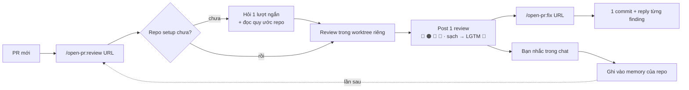

<p align="center">
  
</p>

<h1 align="center">Open PullRequest</h1>

<p align="center"><em>/open-pr:review — agent review Pull/Merge Request theo convention của chính dự án bạn</em></p>

<p align="center">
  <a href="https://github.com/TOMOSIA-VIETNAM/open-pr/releases"></a>
  <a href="./LICENSE"></a>
  <a href="https://claude.ai/code"></a>
</p>

<p align="center">
  <a href="./README.md">English</a> · <strong>Tiếng Việt</strong> · <a href="./README.ja.md">日本語</a>
</p>

PR vào. Bạn mở diff, và câu hỏi đầu tiên hiện lên thường không phải "code này đúng chưa", mà là "dev có
tự đọc lại lần nào trước khi gửi không".

Nhờ agent review giúp, nó trả về một danh sách rất tự tin: đặt tên biến cho rõ, thêm test, tách hàm cho
gọn. Toàn luật chung, không phải luật của dự án này. Bạn xoá vài dòng, sửa vài chỗ, rồi comment nhắc lại
quy ước team đã chốt từ tháng trước. PR sau, nó vẫn nói y như cũ — nó không nhớ gì cả.

Đến lúc nhờ nó fix: 6 commit cho 3 finding, hoặc amend thẳng vào commit bạn vừa review rồi force-push —
diff bạn đã đọc biến mất, coi như review lại từ đầu. Không comment nào được reply, nên chẳng ai biết cái
gì đã sửa, cái gì bị bỏ qua.

`open-pr` sinh ra cho đúng chỗ đó: một plugin Claude Code review PR/MR theo quy ước sẵn có của repo, ghi
nhớ những gì bạn nhắc, và lần nào cũng đi qua cùng một quy trình — cùng một tone, cùng một cách phân
loại, cùng một cách để lại dấu vết trên PR.

Hỗ trợ **GitHub** (`.../pull/<n>`) và **GitLab** (`.../-/merge_requests/<n>`, kể cả self-hosted).
Bitbucket thì chưa.

<table>
<tr>
<td width="50%" valign="top"></td>
<td width="50%" valign="top"></td>
</tr>
<tr>
<td align="center"><sub>Overview — gom finding theo mức độ</sub></td>
<td align="center"><sub>Comment theo dòng, kèm code sửa sẵn</sub></td>
</tr>
</table>

## Nó chạy thế nào



`review` checkout code của PR ra một git worktree riêng, nên branch bạn đang làm không bị đụng tới —
vừa review vừa code bình thường. Và vì nó nắm cả repo chứ không chỉ cái diff, những chỗ liên quan tới
nơi vừa sửa vẫn trong tầm mắt: deadcode, config chết, cái TODO trỏ tới task đã xoá.

## Cài

```
/plugin marketplace add TOMOSIA-VIETNAM/open-pr
/plugin install open-pr@review-pr
```

Cập nhật:

```
/plugin marketplace update review-pr
/plugin update open-pr@review-pr
```

Sau đó `/reload-plugins`, hoặc mở session mới. Nếu bản mới có thêm hoặc đổi config, chạy
`/open-pr:upgrade` một lần trong repo đã setup trước đó — không có gì đổi thì nó báo config đang mới
nhất rồi dừng.

Cần thêm: [Claude Code](https://claude.ai/code), và [`gh`](https://cli.github.com/) (PR GitHub) hoặc
[`glab`](https://gitlab.com/gitlab-org/cli) (MR GitLab) đã login — review được post bằng chính account
đó.

## Command

| Command | Làm gì | Lúc gõ bạn đứng ở đâu | Nó ghi gì |
|---|---|---|---|
| `/open-pr:review <URL>` | Review PR, post đúng **1** review: overview + comment theo dòng. Không sửa code, không close, không merge | trong repo, hoặc trong workspace chứa repo — nó tự tìm theo `git remote` | comment trên PR + memory ở `notebooks/review/<repo>/` |
| `/open-pr:fix <URL>` | Đọc finding từ lần review trước, sửa code, gom **1** commit, rồi reply từng comment. 🔵/📝 luôn hỏi bạn trước | **trong đúng repo đó, và đang ở đúng branch của PR** | code thật tại chỗ bạn đứng + reply trên PR |
| `/open-pr:upgrade` | Nâng config local của repo lên schema mới nhất. Tóm tắt cái gì đổi rồi hỏi, chưa đồng ý thì không ghi gì | trong repo đã setup | `notebooks/review/<repo>/settings.json` |

`fix` thì ngược lại đúng chỗ vừa nói: nó **không** dùng worktree, mà sửa thẳng vào thư mục bạn đang
đứng. Nên trước khi chạm bất cứ file nào, nó soát lại chỗ bạn đứng — sai branch, đang trên
`main`/`develop`, hay đang ở trong chính cái worktree mà `review` tạo ra (worktree đó detached, không có
branch) đều dừng ngay. Mặc định commit xong là dừng ở local, chờ bạn nói "push" mới push và reply.

Command chỉ chạy khi bạn tự gõ. Viết thêm gì sau URL thì phần đó chỉ áp cho lần chạy đó; nhiều URL thì
chạy lần lượt, không song song:

```
/open-pr:review https://github.com/org/repo/pull/123 tập trung phần security
/open-pr:fix    https://github.com/org/repo/pull/123 chỉ sửa phần security
/open-pr:review https://github.com/org/repo-a/pull/12 https://github.com/org/repo-b/pull/34
```

## Nó review những gì

| # | Tiêu chí | Nhìn vào |
|---|---|---|
| 1 | **Bug & logic** | lỗi logic thấy được, edge case (rỗng/null/giới hạn), nhánh điều kiện và đường lỗi có được xử lý |
| 2 | **Security** | secret hardcode, input không kiểm tra đi thẳng vào query/command/render, thiếu check quyền ở hành động nhạy cảm |
| 3 | **Performance** | gọi API/DB/tính toán lặp lại đáng cache hoặc batch, load cả tập dữ liệu lớn thay vì stream |
| 4 | **Chất lượng code** | tên có theo convention dự án, code trùng, một unit làm quá nhiều việc, tàn dư chết (block comment-out, flag/import không dùng, TODO trỏ tới task đã xoá) |
| 5 | **Dễ bảo trì & đọc** | comment ở chỗ logic không hiển nhiên và nói đúng hiện tại (không kể lể quá khứ), test cover cả happy path lẫn error path, thiết kế còn chỗ cho thay đổi kế tiếp |

Trục thứ 6 là phần đặc thù framework/language, do template của từng stack nắm: Rails, Vue, React,
Python, Node.js, Lambda, PHP, Laravel, WordPress, Shell, Makefile, và cả file markdown viết làm
instruction cho AI agent. Gặp stack lạ, nó viết template ngay tại chỗ.

Thứ tự ưu tiên khi có xung đột: rule của team → memory đã học → template của stack → 5 tiêu chí trên.
Rule của team luôn thắng.

## Lần đầu với một repo

Plugin hỏi một lượt ngắn (ngôn ngữ review, post ngay hay để draft, bao lâu đọc lại tài liệu, ngưỡng PR
quá lớn), rồi tự đi đọc những quy ước bạn đã có sẵn: README, CLAUDE.md, AGENTS.md, docs, wiki,
cursor/copilot rules.

Mọi thứ nó ghi nhớ đều nằm ngay trong repo được review, tại `notebooks/review/<repo>/` — một git local
riêng, không push. Đường dẫn này plugin tự thêm vào `.gitignore`.

Rule riêng của team thì viết văn xuôi bình thường vào `ALWAYS_RULE.md` (mặc định rỗng), còn lại nằm ở
`settings.json`:

| Field | Nghĩa | Mặc định |
|---|---|---|
| `shared.chat_language` | ngôn ngữ nói chuyện trong chat | tự nhận |
| `shared.output_language` | ngôn ngữ post lên PR | hỏi một lần rồi lưu |
| `review.auto_submit_review` | `true` = post luôn, `false` = để draft cho bạn xem lại | `false` |
| `review.auto_resolve_fixed_findings` | tự resolve thread khi finding đã được sửa | `false` |
| `review.doctor_schedule` | chu kỳ đọc lại tài liệu quy ước: `"7 days"` \| `"2 weeks"` \| `"1 months"` \| `"never"` | `"1 months"` |
| `review.review_ci_status` | có nhắc CI đang fail hay không (chỉ cảnh báo, không bắt sửa) | có CI ⇒ `true` |
| `review.many_files_threshold` | PR nhiều hơn bấy nhiêu file thì cảnh báo quá lớn | `30` |
| `review.big_file_threshold_kb` | file diff to hơn ngưỡng này bị bỏ khỏi lần đọc đầu | `20` |
| `fix.decline_needs_confirmation` | hỏi bạn trước khi bỏ qua một finding | `true` |
| `fix.auto_push` | tự push sau khi commit | `false` |

Không muốn sửa file thì nói thẳng trong chat cũng được: **reconfigure review**, **doctor again**, hoặc
nêu một rule mới cần ghi nhớ.

## Vì sao không dùng một skill review chung là xong

| Chuyện thường xảy ra | `open-pr` |
|---|---|
| Không biết dev đã tự review chưa | Dev chạy `/open-pr:review` trên PR của mình, reviewer nhìn conversation là biết ngay |
| Reviewer vẫn phải đọc từng dòng từ đầu | AI đi trước, để lại dấu vết công khai; người vẫn chốt cuối, nhưng khởi điểm đã đi được một quãng |
| Góp ý ở mức luật chung, lệch convention dự án | Đọc README/CLAUDE.md/AGENTS.md/docs/wiki của repo, và rule của team thắng mọi luật chung |
| Nhắc xong lần sau vẫn thế | Bạn nhắc trong chat → nó xin phép ghi vào memory của repo đó → lần sau tự áp |
| Tài liệu outdate/xung đột không ai phát hiện | Đến kỳ là đọc lại tài liệu quy ước, thấy lệch thì nêu ra |
| Fix thì spam commit, amend, force-push, không reply | Mỗi lần chạy đúng 1 commit, không ghi đè lịch sử, và reply từng comment sau khi đã push |
| Tự prompt `gh cli` thì mỗi lần một kiểu | Cùng một quy trình, cùng một tone, cùng một cách phân loại mức độ cho mọi lần |

## Vài điều nên biết

- Chạy lại `/open-pr:review` trên cùng PR sau khi dev đã phản hồi hoặc đã fix, nó đọc lại từng thread để
  biết cái gì đã xong. Thấy dev và reviewer chốt một quy ước ngay trong thread, nó đề xuất ghi lại —
  nhưng hỏi bạn trước chứ không tự nhớ: rule nằm trong comment thì ai cũng viết được.
- Muốn tự viết prompt giao review cho subagent thì cho nó `Read` thẳng file command, đừng chép tay rule
  ra — chép tay là lệch.

---

Cài xong, phần khó nhất của việc review sẽ là chọn emoji để approve. Cảnh báo trước: nó hay đào ra
deadcode và config chết mà chính bạn để lại từ năm ngoái, nên đôi khi hơi phũ. Chúc bạn review nhàn, PR
merge ngọt, và CI xanh ngay từ lần đầu 🌟
