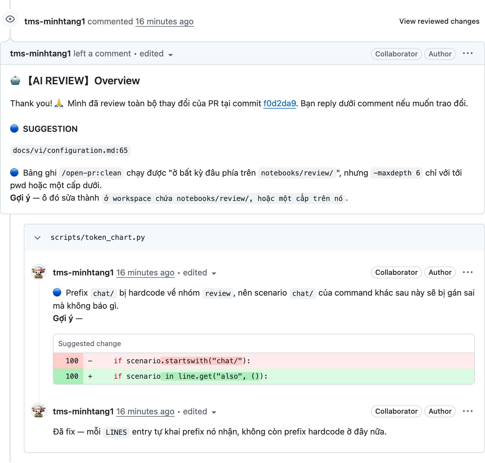
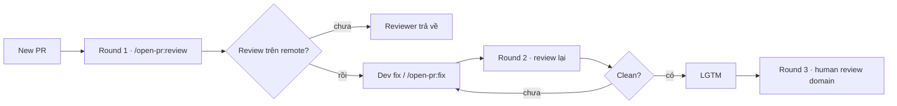
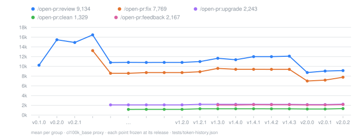

<p align="center">
  <picture>
    <source media="(prefers-color-scheme: dark)" srcset="./docs/images/logo-lockup-dark.svg?v=bar1">
    
  </picture>
</p>

<p align="center">
  <strong>Agent review PR ngay trên GitHub / GitLab</strong><br>
  <code>/open-pr:review</code> · <code>/open-pr:fix</code>
</p>

<p align="center">
  <a href="https://github.com/TOMOSIA-VIETNAM/open-pr/releases"></a>
  <a href="./LICENSE"></a>
  <a href="#cài-đặt"></a>
  <a href="#cài-đặt"></a>
</p>

<p align="center">
  <a href="#cài-đặt"></a>
  <a href="#cài-đặt"></a>
  <a href="#cài-đặt"></a>
  <a href="#cài-đặt"></a>
  <a href="#cài-đặt"></a>
</p>

<p align="center">
  <strong>Tiếng Việt</strong> · <a href="./README.md">English</a> · <a href="./README.ja.md">日本語</a>
</p>

Trong thời buổi AI coding, PR ra nhanh hơn rất nhiều so với tốc độ review. Điểm nghẽn không còn nằm ở coding nữa mà nằm ở **khâu review**. Reviewer vừa phải check convention / security / performance dự án, vừa phải cover business logic — và với tần suất đó, gần như không kham nổi.

Câu hỏi thật ra thường không phải *"code này đúng chưa?"*, mà là: **dev đã self-review PR trước khi gửi chưa**, hay cứ mặc định *"có reviewer lo"*? Điều này không khác gì reviewer chính là công cụ *vibecoding* cho AI.

Nếu review ở local thì khó tin. Ai cũng có thể nói *"tôi review rồi"*. Vì vậy `open-pr` đưa bước đó lên **remote** để minh bạch — comment nằm ngay trên PR, ai vào cũng thấy.

- `/open-pr:review <PR_URL>` → đúng **1** review (overview + line comment)
- Dev đọc comment rồi tự fix, hoặc dùng `/open-pr:fix <PR_URL>` (**1** commit + reply từng thread)
- Mỗi lần chạy cùng một procedure: đọc convention repo, tự ghi nhớ những gì team đã thảo luận trong PR

> [!NOTE]
> **Review rounds** (gợi ý cho team):
> 1. **Round 1** — Dev tự chạy AI review trên PR. Chưa thấy comment review → reviewer **trả về**, chưa đụng vào.
> 2. **Round 2** — Reviewer chạy lại (AI). Sạch → **LGTM**.
> 3. **Round 3** — Reviewer review phần domain.

> [!IMPORTANT]
> AI giảm gánh nặng ở khâu quy trình, nhưng **trách nhiệm cuối cùng vẫn là bạn**.

## Cài đặt

[Claude Code](https://claude.ai/code):

```bash
/plugin marketplace add TOMOSIA-VIETNAM/open-pr
/plugin install open-pr@open-pr
```

**Cài đặt cho Cursor, Codex, Gemini CLI, Antigravity:**

```bash
curl -fsSL https://raw.githubusercontent.com/TOMOSIA-VIETNAM/open-pr/main/install.sh | bash
```

Hướng dẫn chi tiết: [Cài đặt](./docs/vi/install.md).

## Kết quả trông như thế nào

Một lần chạy cho ra ba phần gắn với nhau: **overview**, **line comment** (kèm suggested change), và **reply** sau khi `/open-pr:fix` đã push.

<a href="./docs/vi/demo.md"></a>

[Xem demo](./docs/vi/demo.md) · hỗ trợ GitHub (`.../pull/<n>`) và GitLab (`.../-/merge_requests/<n>`, kể cả self-hosted).

## Khác gì so với skill review phổ thông

Nhiều skill review chỉ là một file `SKILL.md` mô tả. Mỗi lần chạy một kiểu — wording khác, độ khắt khác, dễ lệch convention dự án.

| Hay gặp với skill generic | Với `open-pr` |
| --- | --- |
| Advice dừng ở luật chung, lệch project | Đọc README / CLAUDE.md / AGENTS.md / docs / wiki; **team rule thắng** generic rule |
| Remind xong, lần sau vẫn mắc lại | Mentions trong chat → xin ghi vào memory của repo → lần sau tự apply |
| Bảo fix là fix theo comment — kể cả comment sai → code đúng thành sai | `/open-pr:fix` tự cân comment hợp lý hay không; không hợp lý thì **reply + đưa dẫn chứng**, không đụng code |
| Fix bị spam commit, amend, force-push, không reply | Đúng **1 commit** mỗi lần `fix`, không rewrite history, reply từng comment sau khi push |

> [!TIP]
> Điểm đáng giữ nhất: dù chạy lúc nào, procedure cũng giống nhau — bootstrap convention, chọn output language theo repo, rồi memory những gì team đã remind. Không phải hôm nay AI một giọng, ngày mai một giọng khác.

## Flow Review



Chi tiết re-review, worktree, và guard trước khi `fix`: [Flow re-review/fix](./docs/vi/how-it-works.md).

## Commands

| Command | Làm gì |
| --- | --- |
| `/open-pr:review <PR_URL>` | Post đúng **1** review. Không edit code, không close, không merge. Lần đầu trong repo thì setup luôn |
| `/open-pr:fix <PR_URL>` | Đọc finding → cân đúng/sai → fix → **1** commit → reply. 🔵 / 📝 luôn ask trước |
| `/open-pr:upgrade` | Nâng local config lên schema hiện tại — summarize rồi hỏi; chưa đồng ý thì không ghi gì |
| `/open-pr:clean` | Xóa worktree mà `review` đã checkout (ask trước). Memory / settings không bị đụng |

> [!WARNING]
> `fix` sửa **code thật** trong repo (hoặc review worktree). Chỉ chạy khi bạn chủ động muốn nó xử lý comment.

Full configuration: [Cấu hình](./docs/vi/configuration.md).

## Review những gì

1. **Bugs & logic**
2. **Security**
3. **Performance**
4. **Code quality**
5. **Maintainability & readability**
6. **Framework / language-specific** — theo template của stack đó

Chi tiết tiêu chí và thứ tự ưu tiên khi conflict: [Nó review những gì](./docs/vi/review-criteria.md).

## Biểu đồ prompt token

Số token bình quân mỗi lần chạy — gồm cả *happy-case* và *bad-case*:



---

Contribute? [CONTRIBUTING.md](./CONTRIBUTING.md).

Enjoy reviewing 🥰
