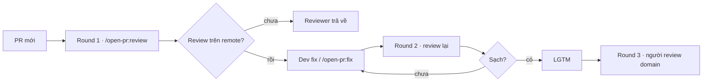

<p align="center">
  <picture>
    <source media="(prefers-color-scheme: dark)" srcset="./docs/images/logo-lockup-dark.svg?v=trim1">
    
  </picture>
</p>

<p align="center">
  <strong>Agent review PR ngay trên GitHub / GitLab</strong><br>
  <code>/open-pr:review</code> · <code>/open-pr:fix</code>
</p>

<p align="center">
  <a href="https://github.com/TOMOSIA-VIETNAM/open-pr/releases"></a>
  <a href="./LICENSE"></a>
  <a href="#cài-đặt"></a>
  <a href="#cài-đặt"></a>
</p>

<p align="center">
  <a href="#cài-đặt"></a>
  <a href="#cài-đặt"></a>
  <a href="#cài-đặt"></a>
  <a href="#cài-đặt"></a>
  <a href="#cài-đặt"></a>
</p>

<p align="center">
  <strong>Tiếng Việt</strong> · <a href="./README.md">English</a> · <a href="./README.ja.md">日本語</a>
</p>

## 30 giây

AI viết code nhanh → PR đổ về dày. Reviewer vừa soi convention, vừa cover nghiệp vụ → không kham nổi.

Câu hỏi thật sự không phải *"code đúng chưa?"* mà là: **dev đã tự đọc lại PR trước khi gửi chưa**, hay cứ nghĩ *"có người review lo"*?

`open-pr` đưa phần self-review đó **lên remote** — ai cũng nhìn thấy trên GitHub / GitLab. Không dựa lời *"tôi review local rồi"*.

- Dán URL → `/open-pr:review` → 1 review (overview + comment đúng dòng)
- Dev đọc comment → tự fix, hoặc `/open-pr:fix` (1 commit + reply từng thread)
- Cùng một quy trình mỗi lần chạy · nhớ convention repo · nhớ lời bạn đã nhắc

> [!IMPORTANT]
> **Luật vòng review (gợi ý dùng trong team):**
> 1. **Round 1** — Dev tự chạy AI review trên PR. Chưa thấy review → reviewer **trả về**, chưa đụng vào.
> 2. **Round 2** — Reviewer (hoặc AI) chạy lại. Sạch → để lại **LGTM**.
> 3. **Round 3** — Người review nghiệp vụ. Trách nhiệm cuối vẫn là con người.

> [!NOTE]
> Trên thực tế dùng trong team, phần soi convention / security / performance AI gánh phần lớn — reviewer còn lại tập trung **domain**. Con số cụ thể mỗi team khác nhau; cái quan trọng là gánh nặng review không còn đổ hết lên một người.

## Cài đặt

[Claude Code](https://claude.ai/code):

```bash
/plugin marketplace add TOMOSIA-VIETNAM/open-pr
/plugin install open-pr@open-pr
```

Cursor, Codex, Gemini CLI, Antigravity:

```bash
curl -fsSL https://raw.githubusercontent.com/TOMOSIA-VIETNAM/open-pr/main/install.sh | bash
```

Gỡ / cập nhật / lệnh từng nền tảng → [Cài đặt](./docs/vi/install.md).

## Trông như thế nào

Một lần review = ba thứ đi cùng nhau: overview, comment đúng dòng (kèm gợi ý sửa), và reply sau khi `fix` đã push.

<a href="./docs/vi/demo.md"></a>

[Xem demo đầy đủ](./docs/vi/demo.md) · GitHub (`.../pull/<n>`) và GitLab (`.../-/merge_requests/<n>`, kể cả self-hosted).

## Vì sao không chỉ một skill `.md`?

Skill review kiểu “một file mô tả” mỗi lần chạy một kiểu — lời văn khác, độ khắt khác, quên convention.

| Chuyện hay gặp | `open-pr` |
| --- | --- |
| Không biết dev đã tự review chưa | Review nằm **trên PR** — nhìn conversation là biết |
| Góp ý kiểu luật chung, lệch dự án | Đọc README / CLAUDE.md / AGENTS.md / docs / wiki; **rule team thắng** |
| Nhắc xong lần sau vẫn thế | Chat → xin ghi memory repo → lần sau tự nhớ |
| Fix spam commit, amend, force-push, không reply | Đúng **1 commit** / lần `fix`, không đè lịch sử, reply từng comment |

> [!TIP]
> Điểm “đời” nhất: chạy lúc nào cũng **cùng một quy trình** — bootstrap convention, chọn ngôn ngữ comment theo repo, rồi memory những gì team đã nhắc. Không phải “hôm nay AI vui, ngày mai AI khác tính”.

## Flow nhanh



Chi tiết re-review, worktree, guard trước khi `fix` đụng file → [Nó chạy thế nào](./docs/vi/how-it-works.md).

## Lệnh

| Lệnh | Làm gì |
| --- | --- |
| `/open-pr:review <URL>` | Post đúng **1** review. Không sửa code, không close, không merge. Lần đầu trong repo → setup luôn |
| `/open-pr:fix <URL>` | Đọc comment → cân đúng/sai → sửa → **1** commit → reply. 🔵 / 📝 luôn hỏi trước |
| `/open-pr:upgrade` | Nâng config local lên schema mới — tóm tắt rồi hỏi, chưa đồng ý thì không ghi |
| `/open-pr:clean` | Xoá worktree review đã checkout (hỏi trước). Memory / settings không đụng |

> [!WARNING]
> `fix` sửa **code thật** trong repo (hoặc worktree review). Chạy khi bạn chủ động muốn nó xử lý comment — đừng coi như “xem thử vô hại”.

Cấu hình đầy đủ → [Cấu hình](./docs/vi/configuration.md).

## Nó soi những gì

1. Bug & logic  
2. Security  
3. Performance  
4. Chất lượng code  
5. Dễ bảo trì & dễ đọc  
6. Đặc thù framework / language (template theo stack)

Rule team thắng cả sáu. Chi tiết → [Nó review những gì](./docs/vi/review-criteria.md).

## Token theo release

Biểu đồ cho ai tò mò “một lần chạy nặng bao nhiêu context” — không bắt buộc đọc trước khi dùng:


---

Góp code? [CONTRIBUTING.md](./CONTRIBUTING.md).

Chúc review nhẹ đầu hơn 🫡
