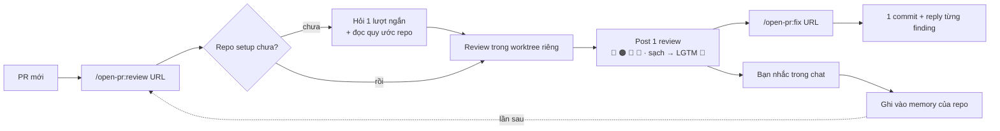

<p align="center">
  
</p>

<h1 align="center">Open PullRequest</h1>

<p align="center"><em>/open-pr:review — Agent Review Pull/Merge Request · GitHub · GitLab</em></p>

<p align="center">
  <a href="https://github.com/TOMOSIA-VIETNAM/open-pr/releases"></a>
  <a href="./LICENSE"></a>
  <a href="https://claude.ai/code"></a>
</p>

<p align="center">
  <strong>Tiếng Việt</strong> · <a href="./README.md">English</a> · <a href="./README.ja.md">日本語</a>
</p>

> Khi bạn nhận PR câu hỏi đầu tiên hiện lên thường không phải "code này đúng chưa", mà là "dev có
> tự đọc lại lần nào trước khi gửi không".

`open-pr` sinh ra cho đúng chỗ đó: một plugin Claude Code review PR theo quy ước sẵn có của repo,
ghi
nhớ những gì bạn nhắc, và lần nào cũng đi qua cùng một quy trình — cùng một tone, cùng một cách phân
loại, cùng một cách để lại dấu vết trên PR.

Hỗ trợ **GitHub** (`.../pull/<n>`) và **GitLab** (`.../-/merge_requests/<n>`, kể cả self-hosted).

## Vì sao không dùng một skill review chung?

| Chuyện thường xảy ra                                | `open-pr`                                                                                        |
| --------------------------------------------------- | ------------------------------------------------------------------------------------------------ |
| Không biết dev đã tự review chưa                    | Dev chạy `/open-pr:review` trên PR của mình, reviewer nhìn conversation là biết ngay             |
| Góp ý ở mức luật chung, lệch convention dự án       | Đọc README/CLAUDE.md/AGENTS.md/docs/wiki của repo, và rule của team thắng mọi luật chung         |
| Nhắc xong lần sau vẫn thế                           | Bạn nhắc trong chat → nó xin phép ghi vào memory của repo đó → lần sau tự áp                     |
| Fix thì spam commit, amend, force-push, không reply | Mỗi lần chạy đúng 1 commit, không ghi đè lịch sử, và reply từng comment sau khi đã push          |

## Nó chạy thế nào



Flow đầy đủ, cơ chế re-review và guard `fix` chạy trước khi sửa file:
[Nó chạy thế nào](./docs/vi/how-it-works.md).

## Cài đặt

```bash
/plugin marketplace add TOMOSIA-VIETNAM/open-pr
/plugin install open-pr@open-pr
```

Cập nhật:

```bash
/plugin marketplace update open-pr
/plugin update open-pr@open-pr
/reload-plugins
/open-pr:upgrade
```

`/open-pr:upgrade` đối chiếu config local của repo với bản mới. Có gì cần đổi thì nó tóm tắt rồi hỏi
—
bạn đồng ý mới ghi; không có gì đổi thì nó nói config đang mới nhất rồi dừng.

Đang dùng bản trước 1.0.0? Marketplace đã đổi tên từ `review-pr` thành `open-pr`, nên phải cài lại
một
lần — `/plugin uninstall open-pr`, `/plugin marketplace remove review-pr`, rồi 2 lệnh cài ở trên.

Cần thêm: [Claude Code](https://claude.ai/code), và [`gh`](https://cli.github.com/) (PR GitHub) hoặc
[`glab`](https://gitlab.com/gitlab-org/cli) (MR GitLab) đã login — review được post bằng chính
account
đó.

## Sử dụng

| Command                 | Làm gì                                                                                                        | Lúc gõ bạn đứng ở đâu                                                              | Nó ghi gì                                             |
| ----------------------- | ------------------------------------------------------------------------------------------------------------- | ---------------------------------------------------------------------------------- | ----------------------------------------------------- |
| `/open-pr:review <URL>` | Review PR, post đúng **1** review: overview + comment line-by-line. Không sửa code, không close, không merge  | ở workspace chứa repo (nên vậy), hoặc trong chính repo — nó tự tìm theo `git remote`  | comment trên PR + memory ở `notebooks/review/<repo>/` |
| `/open-pr:fix <URL>`    | Đọc finding từ lần review trước, sửa code, gom **1** commit, rồi reply từng comment. 🔵/📝 luôn hỏi bạn trước | trong repo đó, hoặc workspace chứa nó — nhưng **repo phải đang ở branch của PR**   | code thật trong repo đó + reply trên PR               |
| `/open-pr:upgrade`      | Nâng config local của repo lên schema mới nhất. Tóm tắt cái gì đổi rồi hỏi, chưa đồng ý thì không ghi gì      | ở workspace hoặc repo đã setup — nhiều repo thì nó cho bạn chọn                       | `notebooks/review/<repo>/settings.json`               |

Command chỉ chạy khi bạn tự gõ, và hỗ trợ cả submodule. Viết thêm gì sau URL thì phần đó chỉ áp cho
lần chạy đó:

```bash
/open-pr:review https://github.com/org/repo/pull/123 [Nội dung]
/open-pr:fix    https://github.com/org/repo/pull/123 [Nội dung]
```

## Nó review những gì

Năm trục cho mọi PR — bug & logic · security · performance · chất lượng code · dễ bảo trì — cộng
trục thứ 6 lấy từ template của stack: Rails, Vue, React, Python, Node.js, Lambda, PHP, Laravel,
WordPress, Shell, Makefile, và markdown viết làm instruction cho AI agent. Stack lạ được viết
template ngay tại chỗ, và rule của team luôn thắng tất cả.

Chi tiết từng trục và thứ tự ưu tiên khi xung đột:
[Nó review những gì](./docs/vi/review-criteria.md).

## Lần đầu với một repo

Plugin hỏi một loạt câu ngắn, chỉ 1 lần cho mỗi repo (ngôn ngữ post lên PR, post ngay hay để draft,
có
tự resolve thread đã fix không, bao lâu đọc lại tài liệu, ngưỡng PR/file quá lớn), rồi tự đi đọc
những
quy ước bạn đã có sẵn: README, CLAUDE.md, AGENTS.md, docs, wiki ...

Memory nằm ở đâu, và mọi setting kèm giá trị mặc định: [Cấu hình](./docs/vi/configuration.md).

## Chi phí context theo release


---

Enjoy reviewing 🥰
