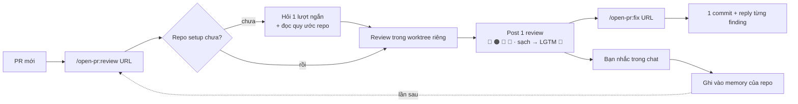

<p align="center">
  
</p>

<h1 align="center">Open PullRequest</h1>

<p align="center"><em>/open-pr:review — Agent Review Pull/Merge Request · GitHub · GitLab</em></p>

<p align="center">
  <a href="https://github.com/TOMOSIA-VIETNAM/open-pr/releases"></a>
  <a href="./LICENSE"></a>
  <a href="https://claude.ai/code"></a>
</p>

<p align="center">
  <strong>Tiếng Việt</strong> · <a href="./README.md">English</a> · <a href="./README.ja.md">日本語</a>
</p>

> Khi bạn nhận PR câu hỏi đầu tiên hiện lên thường không phải "code này đúng chưa", mà là "dev có
> tự đọc lại lần nào trước khi gửi không".

`open-pr` sinh ra cho đúng chỗ đó: một plugin Claude Code review PR theo quy ước sẵn có của repo, ghi
nhớ những gì bạn nhắc, và lần nào cũng đi qua cùng một quy trình — cùng một tone, cùng một cách phân
loại, cùng một cách để lại dấu vết trên PR.

Hỗ trợ **GitHub** (`.../pull/<n>`) và **GitLab** (`.../-/merge_requests/<n>`, kể cả self-hosted).

## Vì sao không dùng một skill review chung?

| Chuyện thường xảy ra                                | `open-pr`                                                                                        |
| --------------------------------------------------- | ------------------------------------------------------------------------------------------------ |
| Không biết dev đã tự review chưa                    | Dev chạy `/open-pr:review` trên PR của mình, reviewer nhìn conversation là biết ngay             |
| Góp ý ở mức luật chung, lệch convention dự án       | Đọc README/CLAUDE.md/AGENTS.md/docs/wiki của repo, và rule của team thắng mọi luật chung         |
| Nhắc xong lần sau vẫn thế                           | Bạn nhắc trong chat → nó xin phép ghi vào memory của repo đó → lần sau tự áp                     |
| Fix thì spam commit, amend, force-push, không reply | Mỗi lần chạy đúng 1 commit, không ghi đè lịch sử, và reply từng comment sau khi đã push          |

## Nó chạy thế nào



Flow đầy đủ, cơ chế re-review và guard `fix` chạy trước khi sửa file:
[Nó chạy thế nào](./docs/vi/how-it-works.md).

### Kết quả trông thế nào

Một review, ba phần gắn với nhau: overview, comment trên đúng dòng kèm code đã sửa, và reply mà `fix`
để lại trên chính thread đó sau khi push.

<a href="./docs/vi/demo.md"></a>

Ảnh full và cùng review đó bằng ngôn ngữ mà mỗi repo tự chọn:
[Một review trông như thế nào](./docs/vi/demo.md).

## Cài đặt

```bash
/plugin marketplace add TOMOSIA-VIETNAM/open-pr
/plugin install open-pr@open-pr
```

Cập nhật:

```bash
/plugin marketplace update open-pr
/plugin update open-pr@open-pr
/reload-plugins
/open-pr:upgrade
```

Cần thêm [Claude Code](https://claude.ai/code), và [`gh`](https://cli.github.com/) cho PR GitHub hoặc
[`glab`](https://gitlab.com/gitlab-org/cli) cho MR GitLab, đã login — review được post bằng chính
account đó.

Cursor, Codex, Gemini CLI và Antigravity chạy cùng một review qua plugin system của chúng, còn ở mức
thử nghiệm: [Cài đặt](./docs/install.md).

## Sử dụng

| Command | Làm gì |
| ------- | ------ |
| `/open-pr:review <URL>` | Review PR và post đúng **1** review: overview + comment line-by-line. Không sửa code, không close, không merge. Lần đầu trong một repo thì nó setup luôn |
| `/open-pr:fix <URL>` | Đọc finding mà review để lại, sửa code, gom **1** commit, rồi reply từng comment. 🔵/📝 luôn hỏi bạn trước |
| `/open-pr:upgrade` | Nâng config local của repo lên schema hiện tại. Tóm tắt cái gì đổi rồi hỏi; chưa đồng ý thì không ghi gì |
| `/open-pr:clean` | Xoá các worktree mà `review` đã checkout code PR ra — mỗi cái là một bản checkout đầy đủ trên đĩa. Liệt kê kèm dung lượng rồi hỏi trước; memory và settings không bị chạm |

Đứng ở đâu, mỗi command ghi gì, mọi setting: [Cấu hình](./docs/vi/configuration.md).

## Nó review những gì

1. **Bug & logic**
2. **Security**
3. **Performance**
4. **Chất lượng code**
5. **Dễ bảo trì & dễ đọc**
6. **Đặc thù framework/language** — lấy từ template của chính stack đó

Rule của team thắng cả 6.

Chi tiết từng tiêu chí và thứ tự ưu tiên khi xung đột:
[Nó review những gì](./docs/vi/review-criteria.md).

## Chi phí context theo release


---

Enjoy reviewing 🥰
