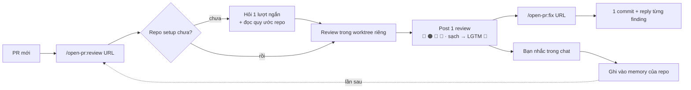
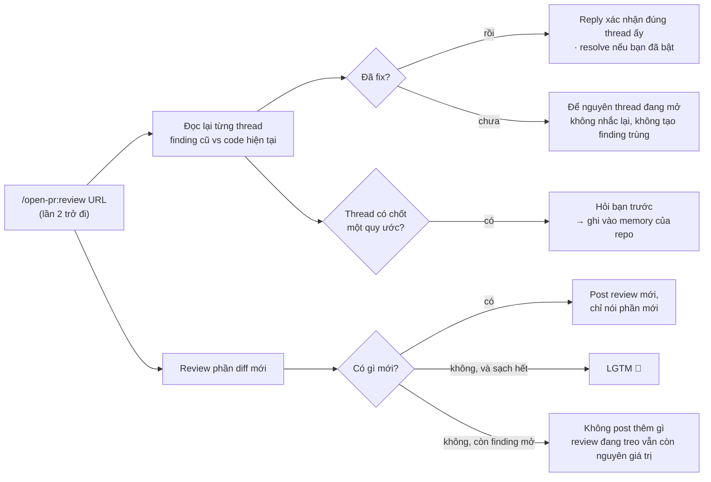
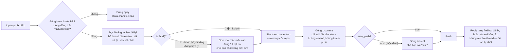

<p align="center">
  
</p>

<h1 align="center">Open PullRequest</h1>

<p align="center"><em>/open-pr:review — Agent Review Pull/Merge Request · GitHub · GitLab</em></p>

<p align="center">
  <a href="https://github.com/TOMOSIA-VIETNAM/open-pr/releases"></a>
  <a href="./LICENSE"></a>
  <a href="https://claude.ai/code"></a>
</p>

<p align="center">
  <strong>Tiếng Việt</strong> · <a href="./README.md">English</a> · <a href="./README.ja.md">日本語</a>
</p>

> Khi bạn nhận PR câu hỏi đầu tiên hiện lên thường không phải "code này đúng chưa", mà là "dev có
> tự đọc lại lần nào trước khi gửi không".

`open-pr` sinh ra cho đúng chỗ đó: một plugin Claude Code review PR theo quy ước sẵn có của repo, ghi
nhớ những gì bạn nhắc, và lần nào cũng đi qua cùng một quy trình — cùng một tone, cùng một cách phân
loại, cùng một cách để lại dấu vết trên PR.

Hỗ trợ **GitHub** (`.../pull/<n>`) và **GitLab** (`.../-/merge_requests/<n>`, kể cả self-hosted).

## Vì sao không dùng một skill review chung?


| Chuyện thường xảy ra                                | `open-pr`                                                                                        |
| --------------------------------------------------- | ------------------------------------------------------------------------------------------------ |
| Không biết dev đã tự review chưa                    | Dev chạy `/open-pr:review` trên PR của mình, reviewer nhìn conversation là biết ngay             |
| Tốn thời gian review các lỗi lặt vặt, lỗi nghiệp vụ cơ bản | AI review trước, để lại dấu vết công khai; Reviewer vẫn phải chốt cuối, nhưng khởi điểm đã được dọn sạch |
| Góp ý ở mức luật chung, lệch convention dự án       | Đọc README/CLAUDE.md/AGENTS.md/docs/wiki của repo, và rule của team thắng mọi luật chung         |
| Nhắc xong lần sau vẫn thế                           | Bạn nhắc trong chat → nó xin phép ghi vào memory của repo đó → lần sau tự áp                     |
| Tài liệu outdate/xung đột không ai phát hiện        | Đến kỳ là đọc lại tài liệu quy ước, thấy lệch thì nêu ra                                         |
| Fix thì spam commit, amend, force-push, không reply | Mỗi lần chạy đúng 1 commit, không ghi đè lịch sử, và reply từng comment sau khi đã push          |
| Tự prompt `gh cli` thì mỗi lần một kiểu             | Cùng một quy trình, cùng một tone, cùng một cách phân loại mức độ cho mọi lần                    |


## Nó chạy thế nào



`review` checkout code của PR ra một git worktree riêng, nên branch bạn đang làm không bị đụng tới —
vừa review vừa code bình thường. Nó không chỉ nhìn những chỗ PR sửa mà ngắm cả logic liên quan, nên
deadcode và bug nghiệp vụ nằm ngoài diff cũng không lọt. Những gì ngoài scope nhưng vẫn ảnh hưởng thì
nó nêu thành lời khuyên để bạn cân, không tính là finding phải sửa.

Gõ lại `/open-pr:review` trên cùng PR sau khi dev đã fix hoặc đã phản hồi thì nó không review lại từ
đầu, mà nối tiếp lần trước:



Quy ước chốt trong thread nó luôn hỏi bạn trước chứ không tự nhớ: rule nằm trong comment thì ai cũng
viết được.

`/open-pr:fix` đi ngược chiều: nó đọc chính những finding `review` để lại, rồi sửa code thật:



Khác `review` ở chỗ nó **không** dùng worktree, mà sửa thẳng vào repo thật trên đĩa. Nên trước khi chạm
bất cứ file nào, nó soát chỗ sắp sửa — sai branch, đang trên `main`/`develop`, hay đang ở trong chính
cái worktree mà `review` tạo ra (worktree đó detached, không có branch) đều dừng ngay.

## Cài đặt

```bash
/plugin marketplace add TOMOSIA-VIETNAM/open-pr
/plugin install open-pr@open-pr
```

Cập nhật:

```bash
/plugin marketplace update open-pr
/plugin update open-pr@open-pr
/reload-plugins
/open-pr:upgrade
```

`/open-pr:upgrade` đối chiếu config local của repo với bản mới. Có gì cần đổi thì nó tóm tắt rồi hỏi —
bạn đồng ý mới ghi; không có gì đổi thì nó nói config đang mới nhất rồi dừng.

Đang dùng bản trước 1.0.0? Marketplace đã đổi tên từ `review-pr` thành `open-pr`, nên phải cài lại một
lần — `/plugin uninstall open-pr`, `/plugin marketplace remove review-pr`, rồi 2 lệnh cài ở trên.

Cần thêm: [Claude Code](https://claude.ai/code), và [`gh`](https://cli.github.com/) (PR GitHub) hoặc
[`glab`](https://gitlab.com/gitlab-org/cli) (MR GitLab) đã login — review được post bằng chính account
đó.

## Sử dụng


| Command                 | Làm gì                                                                                                        | Lúc gõ bạn đứng ở đâu                                                              | Nó ghi gì                                             |
| ----------------------- | ------------------------------------------------------------------------------------------------------------- | ---------------------------------------------------------------------------------- | ----------------------------------------------------- |
| `/open-pr:review <URL>` | Review PR, post đúng **1** review: overview + comment line-by-line. Không sửa code, không close, không merge  | ở workspace chứa repo (nên vậy), hoặc trong chính repo — nó tự tìm theo `git remote`  | comment trên PR + memory ở `notebooks/review/<repo>/` |
| `/open-pr:fix <URL>`    | Đọc finding từ lần review trước, sửa code, gom **1** commit, rồi reply từng comment. 🔵/📝 luôn hỏi bạn trước | trong repo đó, hoặc workspace chứa nó — nhưng **repo phải đang ở branch của PR**   | code thật trong repo đó + reply trên PR               |
| `/open-pr:upgrade`      | Nâng config local của repo lên schema mới nhất. Tóm tắt cái gì đổi rồi hỏi, chưa đồng ý thì không ghi gì      | ở workspace hoặc repo đã setup — nhiều repo thì nó cho bạn chọn                       | `notebooks/review/<repo>/settings.json`               |


Command chỉ chạy khi bạn tự gõ, và hỗ trợ cả submodule. Viết thêm gì sau URL thì phần đó chỉ áp cho
lần chạy đó:

```bash
/open-pr:review https://github.com/org/repo/pull/123 [Nội dung]
/open-pr:fix    https://github.com/org/repo/pull/123 [Nội dung]
```

### Nên thiết lập ở workspace

```
✅ đứng ở workspace                          ❌ đứng trong repo
─────────────────────────                    ─────────────────────────
workspace/            ← gõ ở đây             repo-backend/         ← gõ ở đây
├── notebooks/review/  memory + worktree     ├── notebooks/review/  memory nằm TRONG dự án
│   ├── repo-backend/  ngoài mọi repo        ├── .gitignore         +1 dòng — thay đổi thật
│   └── repo-frontend/                       └── src/
├── repo-backend/     ← sạch, 0 file lạ
└── repo-frontend/    ← sạch, 0 file lạ      (repo-frontend? không thấy)
```

`notebooks/review/` — memory + worktree — luôn sinh ra ngay tại chỗ bạn gõ command. Đứng trong repo thì
nó nằm trong dự án; plugin có tự thêm 1 dòng vào `.gitignore` nên `git status` vẫn sạch, nhưng dòng đó
là một thay đổi thật trong repo của bạn.

Đứng ở workspace thì repo không hề bị chạm, và vì các repo nằm cạnh nhau nên nó review được PR chéo
repo — nhiều PR của cùng một tính năng trong một lượt, chạy lần lượt chứ không song song. Đứng trong
`repo-backend` thì `repo-frontend` là vô hình:

```bash
cd ~/workspace
/open-pr:review https://github.com/org/repo-backend/pull/12 https://github.com/org/repo-frontend/pull/34
```

`/open-pr:fix` cũng gọi được từ workspace — nó tự tìm đúng repo rồi vào đó sửa, miễn repo ấy đang đứng
ở branch của PR.


## Nó review những gì


| #   | Tiêu chí             | Nhìn vào                                                                                                                                                        |
| --- | -------------------- | --------------------------------------------------------------------------------------------------------------------------------------------------------------- |
| 1   | **Bug & logic**      | lỗi logic thấy được, edge case (rỗng/null/giới hạn), nhánh điều kiện và đường lỗi có được xử lý                                                                 |
| 2   | **Security**         | secret hardcode, input không kiểm tra đi thẳng vào query/command/render, thiếu check quyền ở hành động nhạy cảm                                                 |
| 3   | **Performance**      | gọi API/DB/tính toán lặp lại đáng cache hoặc batch, load cả tập dữ liệu lớn thay vì stream                                                                      |
| 4   | **Chất lượng code**  | tên có theo convention dự án, code trùng, một unit làm quá nhiều việc, tàn dư chết (block comment-out, flag/import không dùng, TODO trỏ tới task đã xoá)        |
| 5   | **Dễ bảo trì & đọc** | comment ở chỗ logic không hiển nhiên và nói đúng hiện tại (không kể lể quá khứ), test cover cả happy path lẫn error path, thiết kế còn chỗ cho thay đổi kế tiếp |


**Tiêu chí 6** là phần đặc thù framework/language, do template của từng stack nắm: Rails, Vue, React,
Python, Node.js, Lambda, PHP, Laravel, WordPress, Shell, Makefile, và cả file markdown viết làm
instruction cho AI agent. Gặp stack lạ, nó viết template ngay tại chỗ.

Thứ tự ưu tiên khi có xung đột: rule của team → memory đã học → template của stack → 5 tiêu chí trên.
Rule của team luôn thắng.

## Lần đầu với một repo

Plugin hỏi một loạt câu ngắn, chỉ 1 lần cho mỗi repo (ngôn ngữ post lên PR, post ngay hay để draft, có
tự resolve thread đã fix không, bao lâu đọc lại tài liệu, ngưỡng PR/file quá lớn), rồi tự đi đọc những
quy ước bạn đã có sẵn: README, CLAUDE.md, AGENTS.md, docs, wiki ...

Mọi thứ nó ghi nhớ được index như một mục lục trong `notebooks/review/<repo>/memory.md`: vừa tiết kiệm
token vì không phải nạp chi tiết, vừa nắm được toàn cảnh những gì đã học. Chi tiết nằm rời từng file
trong `notebooks/review/<repo>/memories/*.md`. Cả thư mục `notebooks/review/` do một git local độc lập
quản lý — không remote, không push — nên bạn theo dõi được memory thay đổi qua từng lần review.

Rule riêng của team thì viết văn xuôi bình thường vào `ALWAYS_RULE.md` (mặc định rỗng), còn lại nằm ở
`settings.json`:


| Field                                | Nghĩa                                                                                     | Mặc định            |
| ------------------------------------ | ----------------------------------------------------------------------------------------- | ------------------- |
| `shared.chat_language`               | ngôn ngữ nói chuyện trong chat                                                            | tự nhận             |
| `shared.output_language`             | ngôn ngữ post lên PR                                                                      | hỏi một lần rồi lưu |
| `review.auto_submit_review`          | `true` = post luôn, `false` = để draft cho bạn xem lại                                    | `false`             |
| `review.auto_resolve_fixed_findings` | tự resolve thread khi finding đã được sửa                                                 | `false`             |
| `review.doctor_schedule`             | chu kỳ đọc lại tài liệu quy ước: `"{N} days"` \| `"{N} weeks"` \| `"{N} months"` \| `"never"` | `"1 months"`     |
| `review.review_ci_status`            | có nhắc CI đang fail hay không (chỉ cảnh báo, không bắt sửa)                              | có CI ⇒ `true`      |
| `review.many_files_threshold`        | PR nhiều hơn bấy nhiêu file thì cảnh báo quá lớn                                          | `30`                |
| `review.big_file_threshold_kb`       | file diff to hơn ngưỡng này bị bỏ khỏi lần đọc đầu                                        | `20`                |
| `fix.decline_needs_confirmation`     | hỏi bạn trước khi bỏ qua một finding                                                      | `true`              |
| `fix.auto_push`                      | tự push sau khi commit                                                                    | `false`             |

---

Enjoy reviewing 🥰
