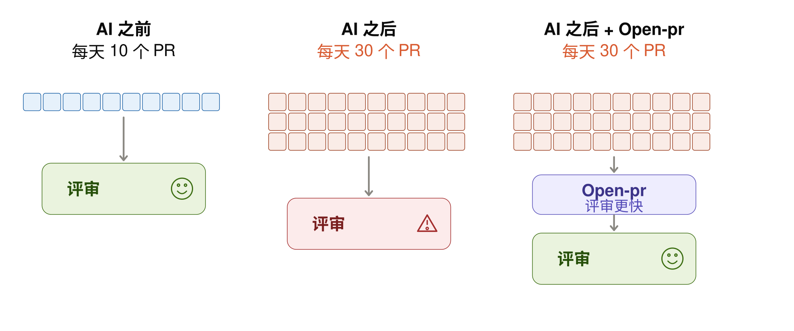
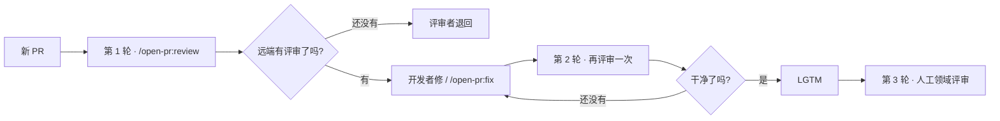

<p align="center">
  <picture>
    <source media="(prefers-color-scheme: dark)" srcset="./docs/images/logo/logo-lockup-dark.svg?v=moth1">
    
  </picture>
</p>

<p align="center">
  <strong>AI 代码评审，直接落在你的 PR 上。</strong><br>
  <strong>开源。自托管。</strong><br>
  <sub>支持 <picture><source media="(prefers-color-scheme: dark)" srcset="./docs/images/icon/github-dark.png"></picture>&nbsp;GitHub · &nbsp;GitLab · &nbsp;Bitbucket</sub><br>
  <code>/open-pr:review</code> · <code>/open-pr:fix</code>
</p>

<p align="center">
  <a href="https://github.com/TOMOSIA-VIETNAM/open-pr/releases"></a>
  <a href="./LICENSE"></a>
  <a href="https://github.com/hashgraph-online/awesome-ai-plugins#development--workflow"></a>
  <a href="#安装"></a>
  <a href="#安装"></a>
  <a href="#安装"></a>
</p>

<p align="center">
  <a href="#安装"></a>
  <a href="#安装"></a>
  <a href="#安装"></a>
  <a href="#安装"></a>
  <a href="#安装"></a>
</p>

<p align="center">
  <a href="./README.vi-VN.md">Tiếng Việt</a> · <a href="./README.md">English</a> · <a href="./README.ja-JP.md">日本語</a> · <strong>简体中文</strong>
</p>

AI 编码让 PR 变快了。但评审并没有变快。

**`open-pr` 把第一轮评审跑在 PR 上，而不是你的本地。** 任何打开这个 PR 的人，看到的都是同一份反馈。

<p align="center">
  <a href="./docs/zh-Hans/demo.md"></a>
</p>

一次运行会产出三个互相关联的部分：**总览**、**行级评论**（附带 suggested change），以及 `/open-pr:fix` 推送之后的 **回复**。 —— [查看演示](./docs/zh-Hans/demo.md)

- 🔍 **每次运行恰好 1 条评审** —— 只发一条，不是源源不断的 bot 评论
- 🧠 **学习你的仓库** —— 读 README / CLAUDE.md / AGENTS.md / docs / wiki；**团队规范优先于通用规则**
- 💬 **记住团队说过的话** —— 这次 PR 上的一句纠正，下次运行就会应用
- 🔧 **`/open-pr:fix` 有纪律** —— 恰好 **1** 个 commit，不 force-push，每个 thread 一条回复
- 🔓 **开源，无需 `open-pr` 服务** —— MIT 许可，不需要 `open-pr` 的服务器、也不需要 bot 账号；就跑在你已经在用的 agent CLI 里

## 已收录于 Awesome AI Plugins

`open-pr` 已收录于 Hashgraph Online 维护的跨平台目录 [Awesome AI Plugins](https://github.com/hashgraph-online/awesome-ai-plugins#development--workflow) 的 *Community Plugins → Development & Workflow* 分类，并被 [HOL Plugin Registry](https://hol.org/registry/plugins) 收录——该 registry 会扫描所有上榜项目并公布 trust score。

收录的门槛正是这次扫描：**score ≥ 80，且没有 high 或 critical 级别的 finding**。扫描由目录方自己针对本仓库的默认分支运行，结果不是我们自报的。扫描是信任信号，不是安全保证。

## 安装

**1. 先登录对应平台的 CLI。** 插件本身不持有任何 credential —— 它用*你的*账号读取 PR、发表评审：

```bash
# GitHub
brew install gh          # 或 https://cli.github.com/
gh auth login            # GitHub.com → HTTPS → Login with a web browser
gh auth status           # 应显示 "Logged in to github.com as <you>"
```

GitLab：`brew install glab && glab auth login --hostname gitlab.com`。Bitbucket 没有 CLI —— 它从环境变量读取 `BITBUCKET_EMAIL` + `BITBUCKET_API_TOKEN`。各平台的最小权限与自查方法：[各平台如何取得 token](./docs/zh-Hans/credentials.md)。

**2. 插件。** [Claude Code](https://claude.ai/code)：

```bash
/plugin marketplace add TOMOSIA-VIETNAM/open-pr
/plugin install open-pr@open-pr
```

**在 Cursor、Codex、Gemini CLI、Antigravity 上安装：**

```bash
curl -fsSL https://raw.githubusercontent.com/TOMOSIA-VIETNAM/open-pr/main/install.sh | bash
```

完整指南：[安装](./docs/zh-Hans/install.md) · [各平台如何取得 token](./docs/zh-Hans/credentials.md)。

PR URL 格式：GitHub `.../pull/<n>` · GitLab `.../-/merge_requests/<n>`（含自建实例）· Bitbucket Cloud `.../pull-requests/<n>`。

## 为什么评审成了瓶颈

<p align="center">
  <picture>
    <source media="(prefers-color-scheme: dark)" srcset="./docs/images/bottleneck/zh-dark.svg">
    
  </picture>
</p>

在 AI 编码的时代，PR 提交的速度远远快过评审的速度。瓶颈已经不在写代码，而在 **评审**。评审者既要检查项目规范 / 安全 / 性能，*还要* 覆盖业务逻辑 —— 随着 PR 数量增长，这种方式并不 scale。

本地评审很难取信于人。谁都可以说 *"我已经审过了"*。所以 `open-pr` 把这一步搬到 **远端**，让它透明 —— 评论就留在 PR 上，任何打开这个 PR 的人都看得见。

> [!NOTE]
> **评审轮次**（给团队的一个建议）：
> 1. **第 1 轮** —— 开发者自己在 PR 上跑一次 AI 评审。还没有评审评论 → 评审者 **直接退回**，不去碰它。
> 2. **第 2 轮** —— 评审者再跑一次（AI）。干净 → **LGTM**。
> 3. **第 3 轮** —— 评审者评审业务领域的部分。

> [!IMPORTANT]
> AI 减轻的是流程负担，但 **最终责任仍然在你身上**。

## 与普通评审 skill 的差别

很多评审 skill 只是一份 `SKILL.md` 说明。每次运行结果都不一样 —— 措辞不同、松紧不同，很容易偏离项目自己的规范。

| 普通 skill 常见情况 | 用 `open-pr` |
| --- | --- |
| 建议停留在通用规则，脱离项目 | 读取 README / CLAUDE.md / AGENTS.md / docs / wiki；**团队规则优先于** 通用规则 |
| 提醒过一次，下次又忘 | 在聊天里提到 → 询问是否写进仓库的 memory → 下次运行就会应用 |
| 让它修就照评论修 —— 哪怕评论是错的 → 正确的代码被改错 | `/open-pr:fix` 会判断评论是否站得住脚；站不住 → **回复 + 依据**，不改代码 |
| 修复变成一堆 commit、amend、force push，也没有回复 | 每次 `fix` 恰好 **1 个 commit**，不重写历史，推送后每条评论都有回复 |

> [!TIP]
> 最值得留下的一点：不论什么时候运行，流程都一样 —— 先建立规范、按仓库选定输出语言，再记住团队提醒过的事。不会今天一个 AI 腔调，明天又换一个。

## 评审流程



关于重复评审、worktree，以及 `fix` 之前的守卫：[重复评审 / fix 流程](./docs/zh-Hans/how-it-works.md)。

## 命令

| 命令 | 作用 |
| --- | --- |
| `/open-pr:review <PR_URL>` | 发布恰好 **1** 条评审。不改代码、不 close、不 merge。仓库第一次运行时会顺带完成初始化 |
| `/open-pr:fix <PR_URL>` | 读取 findings → 判断对错 → 修复 → **1** 个 commit → 回复。🔵 / 📝 一律先问过你 |
| `/open-pr:upgrade` | 把本地配置升到当前 schema —— 先给出摘要再询问；你不同意就什么都不写 |
| `/open-pr:clean` | 删除 `review` 检出的 worktree（会先询问）。memory / 设置不受影响 |
| `/open-pr:feedback` | 把 **本插件** 的问题报到它自己的 issue tracker —— 会剥掉一切能识别你仓库的信息，并在发出前先给你看 |

> [!WARNING]
> `fix` 会改动仓库（或 review worktree）里的 **真实代码**。只有当你确实想让它处理这些评论时才运行它。

完整配置：[配置](./docs/zh-Hans/configuration.md)。

## 评审哪些方面

1. **Bug 与逻辑**
2. **安全**
3. **性能**
4. **代码质量**
5. **可维护性与可读性**
6. **框架 / 语言相关** —— 来自该技术栈的模板

详细标准，以及互相冲突时的优先级：[评审哪些方面](./docs/zh-Hans/review-criteria.md)。

## Prompt token 图表

每次运行的平均 token —— 同时覆盖 *happy-case* 与 *bad-case*：


---

想参与贡献？[CONTRIBUTING.md](./CONTRIBUTING.md)。

评审愉快 🥰

<p align="center">
  <picture>
    <source media="(prefers-color-scheme: dark)" srcset="./docs/images/logo/logo-dark.svg?v=moth1">
    
  </picture>
</p>

<p align="center">
  <sub>Logo 文件: <a href="./docs/zh-Hans/logo.md">docs/zh-Hans/logo.md</a></sub>
</p>
