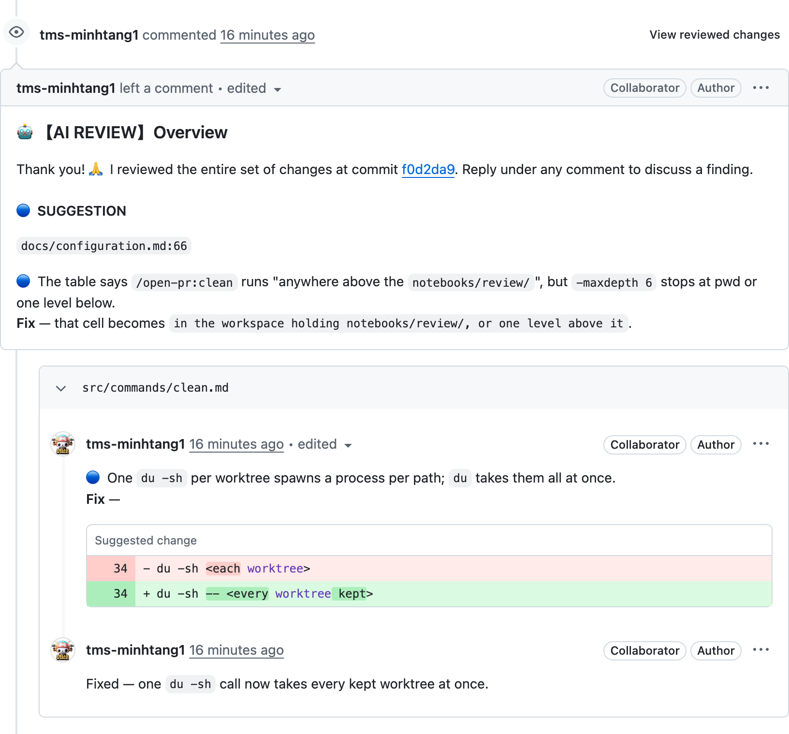
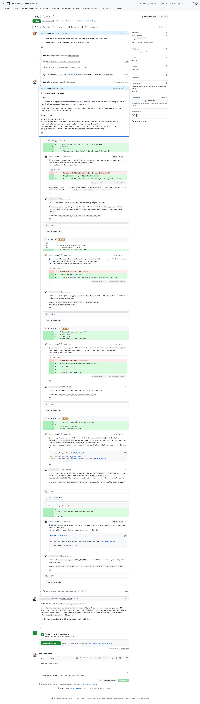
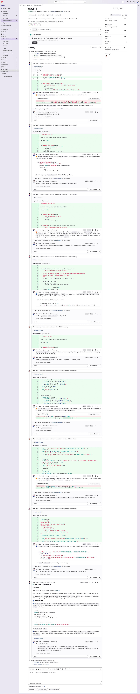
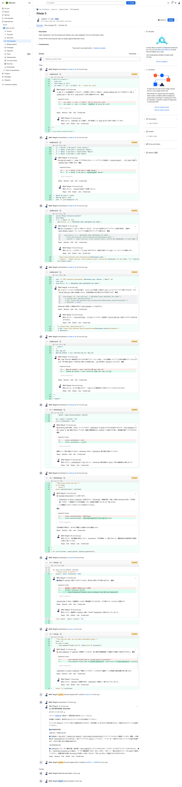

# What it looks like

[← README](../README.md)

A posted review carries **three parts** that belong together:

1. **Overview** — what the whole diff amounts to, anchored to the commit it was read at, grouped by severity. FILE-level findings live here (no specific line to sit on).
2. **Line comment** — LINE-level findings, each with the corrected code in a `suggestion` block so the author can commit it straight from the PR page.
3. **Reply** — `/open-pr:fix` answers on that same thread once the fix is pushed. The conversation stays where the problem was raised, instead of restarting at the top of the PR.

The image below is a real review on a PR in this repository, in the language that repo's `settings.json` selected:

> [!NOTE]
> Language follows the **repo**, not the user. `shared.output_language` decides what gets **POSTED** on the PR — independent of the language the agent talks to you in chat.

The same review in [Vietnamese](./vi-VN/demo.md), [Japanese](./ja-JP/demo.md) and [Simplified Chinese](./zh-Hans/demo.md).

## The same run, on each vendor

A full PR page, top to bottom, on each vendor `open-pr` supports: the overview at the top, the line
comments sitting on the code they are about, the `suggestion` block ready to apply, and the reply once
`/open-pr:fix` had pushed. Each capture is in the language that repo's `settings.json` selected.

<b>GitHub</b> — pull request, review posted in English

<b>GitLab</b> — merge request, review posted in Vietnamese

<b>Bitbucket Cloud</b> — pull request, review posted in Japanese

## Severity

This is the “contract” between reviewer and author:

| | Level | `/open-pr:fix` |
| --- | --- | --- |
| 🔴 | MUST FIX | handles on its own |
| 🟠 | SHOULD FIX | handles on its own |
| 🔵 | SUGGESTION | always **asks** first |
| 📝 | NOTE | always **asks** first |

Nothing to say about the diff → one line **LGTM 🌟**, no headings.

---

[Configuration](./configuration.md) · [What it reviews](./review-criteria.md)
