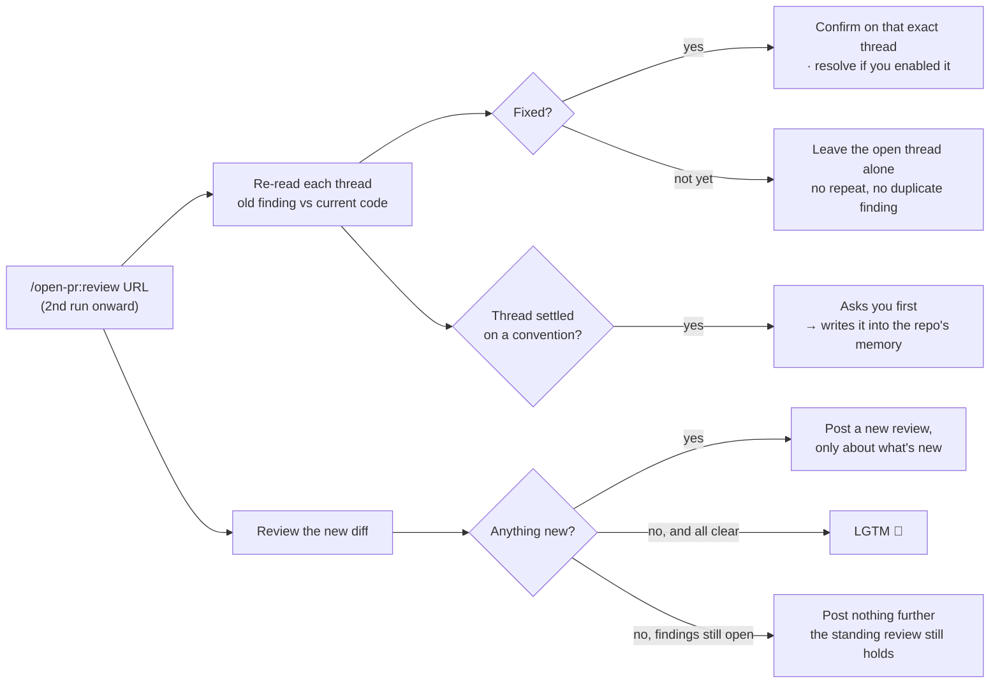
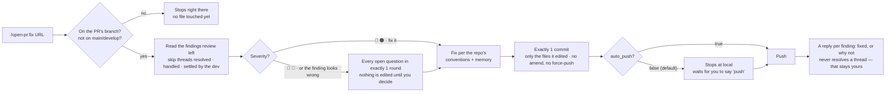

# Re-review / fix flow

[← README](../README.md)

`/open-pr:review` checks the PR's code out into its own **git worktree** — the branch you're working on is never touched. Review and keep coding at the same time.

It doesn't only look at what the PR changed: the logic around it is in scope too, so deadcode and business-logic bugs outside the diff can still be caught. Anything out of scope that still matters comes back as **advice** for you to weigh — not as a finding you must fix.

## Re-review (2nd run onward)

If you're still in the same chat session, just say `please review again` (or type `/open-pr:review` again) on the same PR after the dev has fixed or replied — it does **not** review from scratch; it picks up where the last run left off:



> [!TIP]
> A convention settled in a thread is always **asked of you first**, then written into memory.

## `/open-pr:fix`

Runs the other way: reads the very findings `review` left, then edits **real code**.



> [!WARNING]
> `fix` edits real code in the repo where you are standing. Wrong branch or wrong PR → stops immediately.

## One run at a time

Commands run only when you type them. Submodules are covered. Extra words after the URL apply to **that run only**:

```bash
/open-pr:review https://github.com/org/repo/pull/123 [instructions]
/open-pr:fix    https://github.com/org/repo/pull/123 [instructions]
```

The first run in a repo asks a short batch of questions — the language to post on the PR, post immediately or keep a draft, whether to auto-resolve fixed threads, how often to re-read the docs, the too-large PR / file thresholds — then reads the conventions already there: README, CLAUDE.md, AGENTS.md, docs, wiki.

## Same review on other platforms

The whole procedure the agent follows lives in **one place**: the markdown under `src/`.

Cursor, Codex, Gemini CLI, Antigravity each need their own entry file to expose a slash command — so each gets a short shim that does exactly two things: find where the plugin is installed, then hand over to the same command file. No rule, threshold, or severity is restated in a shim.

---

[Install](./install.md) · [Configuration](./configuration.md) · [What it looks like](./demo.md)
