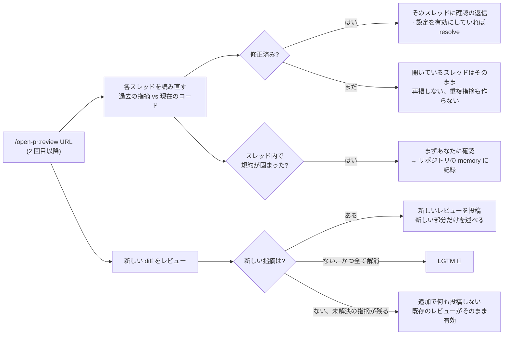
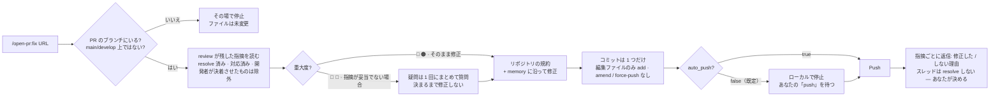

# 再レビュー / fix のフロー

[← README](../../README.ja-JP.md)

`/open-pr:review` は PR のコードを専用の **git worktree** にチェックアウトします — 作業中のブランチには触れません。レビュー中もそのまま開発を続けられます。

PR が変更した箇所だけでなく、その周辺のロジックもスコープに入るので、diff の外にある deadcode や業務ロジックのバグも拾えます。スコープ外だが重要なものは、必ず直すべき finding ではなく、あなたが判断するための **アドバイス** として返します。

## 再レビュー（2 回目以降）

同じチャットセッション内なら、開発者が修正または返信したあと、同じ PR で `もう一度レビューして` と言う（または `/open-pr:review` を再入力する）だけで十分です — **ゼロからやり直さず**、前回の続きから進みます:



> [!TIP]
> スレッド内で固まった規約は、必ず **先にあなたに確認してから** memory に書きます。

## `/open-pr:fix`

逆方向に進みます: `review` が残した指摘そのものを読み、**実コード** を修正します。



> [!WARNING]
> `fix` は、あなたが立っているリポジトリの実コードを編集します。ブランチ違いや PR 違いなら即座に停止します。

## 1 回に 1 実行

コマンドは自分で入力したときだけ実行されます。submodule にも対応します。URL の後ろに書いた指示は **その実行にだけ** 適用されます:

```bash
/open-pr:review https://github.com/org/repo/pull/123 [指示]
/open-pr:fix    https://github.com/org/repo/pull/123 [指示]
```

リポジトリでの初回は短い質問をまとめて訊きます — PR に投稿する言語、即投稿かドラフトか、修正済みスレッドを自動 resolve するか、ドキュメントを読み直す間隔、大きすぎる PR / ファイルのしきい値 — そのうえで、すでにある規約を読みに行きます: README、CLAUDE.md、AGENTS.md、docs、wiki。

## 他のプラットフォームでも同じレビュー

エージェントがたどる手順全体は **1 か所** にあります: `src/` 以下の markdown です。

Cursor・Codex・Gemini CLI・Antigravity はスラッシュコマンドを出すためにそれぞれ独自の入口ファイルが必要なので、それぞれに短いシムを置きます。シムの仕事はちょうど 2 つ: プラグインの設置場所を見つけ、同じコマンドファイルに引き継ぐ。ルール・しきい値・重大度をシムで言い直すことはしません。

---

[インストール](./install.md) · [設定](./configuration.md) · [結果の見え方](./demo.md)
