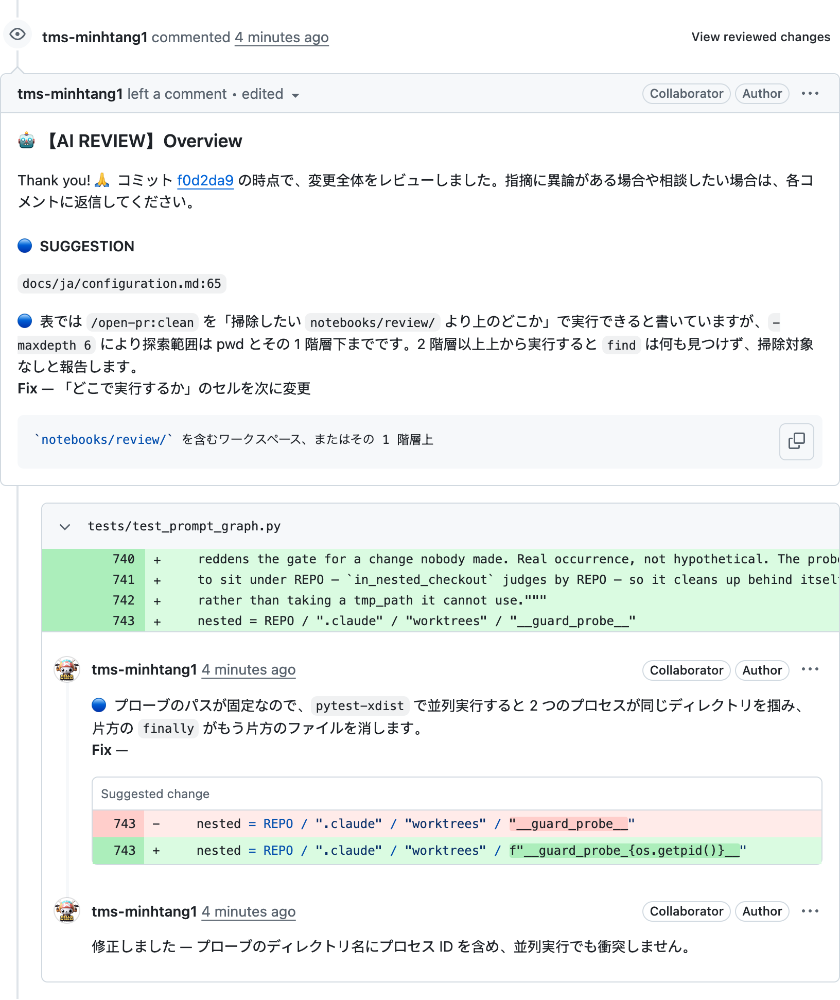

# レビューの見え方

投稿されるレビューは 3 つの要素を同時に持ち、それぞれが結びついています。

1. **Overview** — 差分全体が何を意味するかを、読み取った時点のコミットに紐づけ、重大度ごとにまとめたもの。
   1 行に紐づけられない FILE レベルの指摘はここに入ります。
2. **該当行へのコメント** — LINE レベルの指摘。修正後のコードを `suggestion` ブロックで示すので、作者は
   PR の画面からそのままコミットできます。
3. **返信** — `/open-pr:fix` は push 後に同じスレッドで返信します。会話は問題が提起された場所に留まり、
   PR の先頭からやり直しになりません。

下のスクリーンショットは、このリポジトリ自身の pull request に投稿された実際のレビューで、言語はその
リポジトリの `settings.json` が選んだものです。

言語はユーザー単位ではなくリポジトリ単位です。`shared.output_language` が投稿される言語を決め、エージェント
があなたと話す言語とは独立しています。同じレビューの
[英語版](../demo.md)と[ベトナム語版](../vi/demo.md)もあります。

重大度は作者とレビュアーの間の約束です: 🔴 MUST FIX · 🟠 SHOULD FIX · 🔵 SUGGESTION · 📝 NOTE。
`/open-pr:fix` は 🔴 と 🟠 を自分で処理し、🔵 と 📝 は必ず先に確認します。言うことのない差分には
**LGTM 🌟** の 1 行だけが付き、見出しは一切ありません。

[README](../../README.ja.md) へ戻る · [設定](./configuration.md) ·
[レビュー対象](./review-criteria.md)
