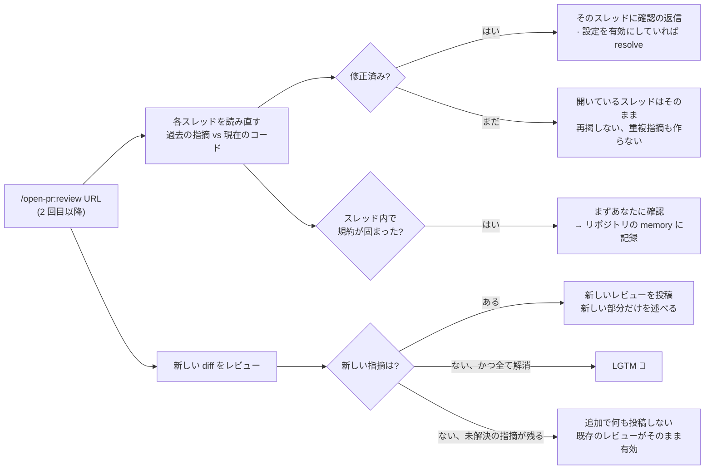
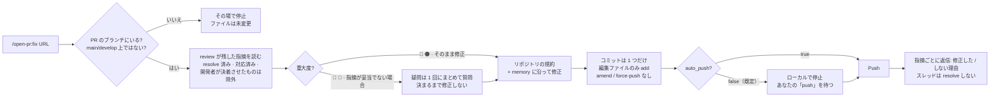

# 動きかた

[← README](../../README.ja.md)

`review` は PR のコードを専用の git worktree にチェックアウトするため、作業中のブランチには一切触れません
— レビュー中もそのまま開発を続けられます。さらに PR が変更した箇所だけでなく、その周辺のロジックも視野に
入れるので、diff の外にある deadcode や業務ロジックのバグも見逃しません。スコープ外だが影響のあるものは、
必ず直すべき指摘ではなく判断材料としてのアドバイスで返します。

開発者が修正または返信したあと、同じ PR でもう一度 `/open-pr:review` を実行しても、ゼロからやり直すのでは
なく前回の続きから進みます:



スレッド内で固まった規約は、勝手に覚えるのではなく必ずあなたに確認します。コメント上のルールは誰でも
書けるからです。

`/open-pr:fix` は逆方向に進みます。`review` が残した指摘そのものを読み、実際のコードを修正します:



`review` と違い worktree は **使わず**、ディスク上の実リポジトリを直接編集します。だからファイルに触れる
前に、これから編集する場所を確認します — ブランチ違い、`main`/`develop` 上、あるいは `review` が作った
worktree の中（detached でブランチがない）なら、いずれもその場で停止します。

## 1 回の実行と、そこに足せるもの

コマンドは自分で入力したときだけ実行され、submodule にも対応します。URL の後ろに書いた指示は、その実行に
だけ適用されます:

```bash
/open-pr:review https://github.com/org/repo/pull/123 [指示]
/open-pr:fix    https://github.com/org/repo/pull/123 [指示]
```

リポジトリでの初回は短い質問をまとめて訊きます — PR に投稿する言語、即投稿かドラフトか、修正済みスレッドを
自動 resolve するか、ドキュメントを読み直す間隔、大きすぎる PR とファイルのしきい値 — そのうえで、すでに
ある規約を読みに行きます: README、CLAUDE.md、AGENTS.md、docs、wiki。

## 他のプラットフォームでも同じレビュー

エージェントがたどる手順 — 上のすべてのステップ — は 1 か所にあります: `src/` 以下の markdown です。
Cursor・Codex・Gemini CLI・Antigravity はスラッシュコマンドを出すためにそれぞれ独自の入口ファイルを
必要とするので、それぞれに短いシムを 1 つ置きます。シムの仕事は 2 つだけ: プラグインの設置場所を見つけ、
Claude Code が読むのと同じコマンドファイルに引き継ぐ。ルール・しきい値・重大度をシムで言い直すことは
しません。だから挙動を変えるのは 1 ファイルの編集で済み、5 プラットフォーム分の編集にはなりません。
各プラットフォームへの導入は [インストール](./install.md) を参照してください。
