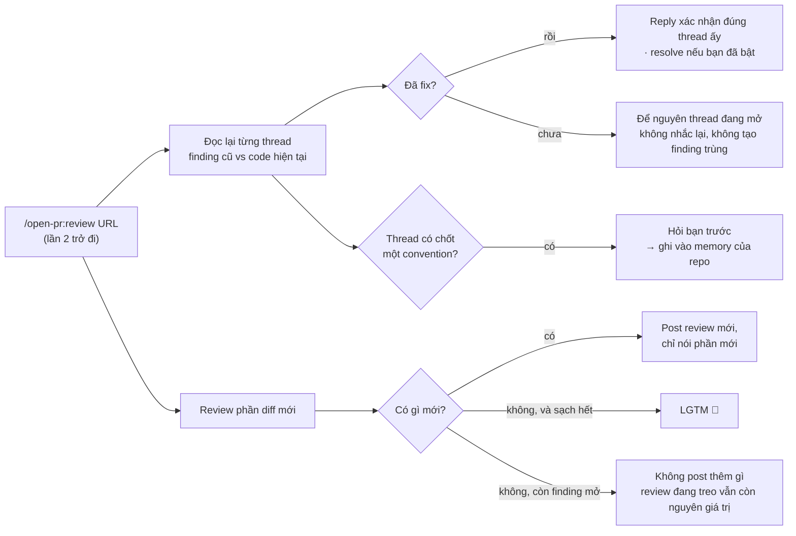
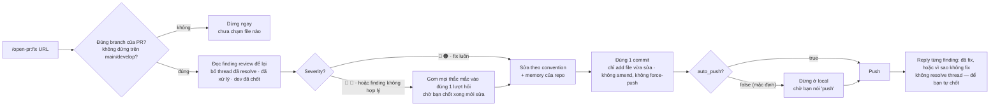

# Flow re-review / fix

[← README](../../README.vi.md)

`/open-pr:review` checkout code của PR ra một **git worktree** riêng — branch bạn đang làm không bị đụng. Vừa review vừa code bình thường.

Nó không chỉ nhìn đúng chỗ PR sửa: logic xung quanh cũng trong scope, nên deadcode và business-logic bug ngoài diff vẫn có thể bị bắt. Thứ ngoài scope nhưng vẫn quan trọng thì nêu thành **advice** để bạn cân — không tính là finding bắt buộc phải fix.

## Re-review (lần 2 trở đi)

Gõ lại `/open-pr:review` trên cùng PR sau khi dev đã fix hoặc reply — nó **không** review từ đầu, mà nối tiếp lần trước:



> [!TIP]
> Convention chốt trong thread luôn được **hỏi bạn trước** rồi mới ghi memory. Ai cũng có thể viết một “rule” trong comment — không để AI tự nhớ một mình.

## `/open-pr:fix`

Đi chiều ngược lại: đọc đúng những finding mà `review` để lại, rồi sửa **code thật**.



> [!WARNING]
> `fix` sửa code trên đĩa: trong repo, hoặc trong worktree mà `review` đã checkout. Nó **không** tự tạo worktree. Sai branch, hoặc PR mà source branch là `main` / `develop` → dừng ngay, chưa đụng file.

## Một lần một run

Command chỉ chạy khi bạn tự gõ. Submodule cũng được cover. Viết thêm gì sau URL thì chỉ áp cho **lần chạy đó**:

```bash
/open-pr:review https://github.com/org/repo/pull/123 [instructions]
/open-pr:fix    https://github.com/org/repo/pull/123 [instructions]
```

Lần đầu với một repo, plugin hỏi một loạt câu ngắn — output language trên PR, post ngay hay draft, có auto-resolve thread đã fix không, chu kỳ đọc lại docs, ngưỡng PR / file quá lớn — rồi tự đọc convention sẵn có: README, CLAUDE.md, AGENTS.md, docs, wiki.

## Cùng một review trên platform khác

Toàn bộ procedure agent đi theo nằm ở **một chỗ**: markdown dưới `src/`.

Cursor, Codex, Gemini CLI, Antigravity mỗi cái cần entry file riêng để lộ slash command — nên mỗi cái nhận một shim ngắn làm đúng hai việc: tìm chỗ plugin được cài, rồi giao lại cho cùng một command file. Không rule, threshold hay severity nào được nhắc lại trong shim.

---

[Cài đặt](./install.md) · [Cấu hình](./configuration.md) · [Kết quả trông như thế nào](./demo.md)
