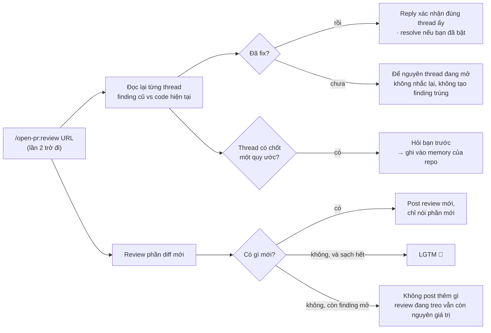
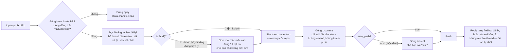

# Nó chạy thế nào

[← README](../../README.vi.md)

`review` checkout code của PR ra một git worktree riêng, nên branch bạn đang làm không bị đụng tới —
vừa review vừa code bình thường. Nó không chỉ nhìn những chỗ PR sửa mà ngắm cả logic liên quan, nên
deadcode và bug nghiệp vụ nằm ngoài diff cũng không lọt. Những gì ngoài scope nhưng vẫn ảnh hưởng thì
nó nêu thành lời khuyên để bạn cân, không tính là finding phải sửa.

Gõ lại `/open-pr:review` trên cùng PR sau khi dev đã fix hoặc đã phản hồi thì nó không review lại từ
đầu, mà nối tiếp lần trước:



Quy ước chốt trong thread nó luôn hỏi bạn trước chứ không tự nhớ: rule nằm trong comment thì ai cũng
viết được.

`/open-pr:fix` đi ngược chiều: nó đọc chính những finding `review` để lại, rồi sửa code thật:



Khác `review` ở chỗ nó sửa code thật: repo trên đĩa, hoặc chính worktree mà `review` đã checkout PR ra
nếu bạn fix liền sau khi review. Nó không tự tạo worktree nào. Nên trước khi chạm file nào, nó soát chỗ
sắp sửa — sai branch, hoặc PR mà branch nguồn là `main`/`develop`, đều dừng ngay.

## Mỗi lần một run, và bạn thêm gì vào đó

Command chỉ chạy khi bạn tự gõ, và hỗ trợ cả submodule. Viết thêm gì sau URL thì phần đó chỉ áp cho
lần chạy đó:

```bash
/open-pr:review https://github.com/org/repo/pull/123 [Nội dung]
/open-pr:fix    https://github.com/org/repo/pull/123 [Nội dung]
```

Lần đầu với một repo, plugin hỏi một loạt câu ngắn — ngôn ngữ post lên PR, post ngay hay để draft, có
tự resolve thread đã fix không, bao lâu đọc lại tài liệu, ngưỡng PR và file quá lớn — rồi tự đọc
những quy ước bạn đã có sẵn: README, CLAUDE.md, AGENTS.md, docs, wiki.

## Cùng một review trên nền tảng khác

Toàn bộ quy trình agent đi theo — mọi bước ở trên — nằm ở một chỗ duy nhất: markdown dưới `src/`.
Cursor, Codex, Gemini CLI và Antigravity mỗi cái cần loại file entry riêng để lộ ra một slash command,
nên mỗi cái nhận một shim ngắn làm đúng hai việc: tìm chỗ plugin được cài, rồi giao lại cho chính file
command mà mọi nền tảng cùng đọc. Không luật, ngưỡng hay severity nào được nhắc lại trong shim.
Cách cài trên các nền tảng đó: [Cài đặt](./install.md).
