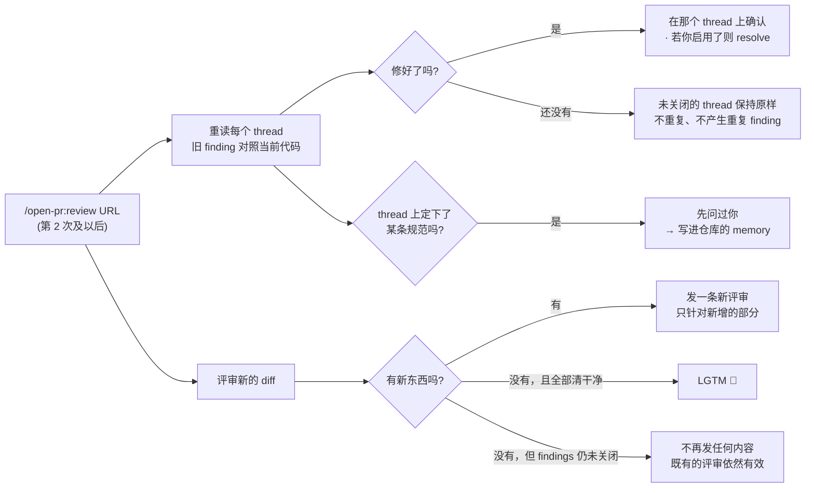
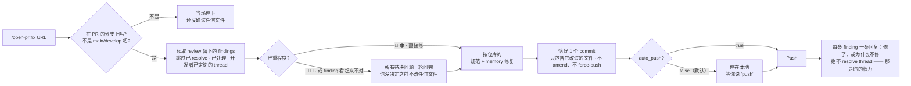

# 重复评审 / fix 流程

[← README](../../README.zh-Hans.md)

`/open-pr:review` 会把 PR 的代码检出到它自己的 **git worktree** —— 你正在开发的分支完全不受影响。可以一边评审一边继续写代码。

它看的不只是 PR 改动的部分：周边的逻辑也在范围内，所以 diff 之外的死代码和业务逻辑 bug 一样可能被发现。超出范围但仍然重要的内容，会以 **建议** 的形式返回给你权衡 —— 而不是必须修的 finding。

## 重复评审（第 2 次及以后）

如果还在同一个聊天会话里，等开发者修完或回复之后，对同一个 PR 再输入一次 `/open-pr:review` —— 它 **不会** 从头评审，而是接着上一次停下的地方继续：



> [!TIP]
> thread 上定下来的规范，一律 **先问过你**，然后才写进 memory。

## `/open-pr:fix`

方向相反：读取 `review` 留下的那些 findings，然后改动 **真实代码**。



> [!WARNING]
> `fix` 会改动你当前所在仓库里的真实代码。分支不对或 PR 不对 → 立即停下。

## 一次只跑一条

命令只有你输入时才会运行。submodule 也在覆盖范围内。URL 后面多写的话，只对 **那一次运行** 生效：

```bash
/open-pr:review https://github.com/org/repo/pull/123 [附加说明]
/open-pr:fix    https://github.com/org/repo/pull/123 [附加说明]
```

仓库第一次运行时会问一小批问题 —— 发布到 PR 上用什么语言、立即发布还是先留草稿、修好的 thread 要不要自动 resolve、隔多久重读一次文档、PR / 文件多大算过大 —— 然后读取已有的规范：README、CLAUDE.md、AGENTS.md、docs、wiki。

## 在其他平台上的同一套评审

agent 遵循的整套流程只存在于 **一个地方**：`src/` 下面的 markdown。

Cursor、Codex、Gemini CLI、Antigravity 各自需要自己的入口文件才能暴露出一个 slash command —— 所以每个平台只有一个很短的 shim，只做两件事：找到插件装在哪里，然后交给同一份命令文件。任何规则、阈值、严重程度都不会在 shim 里重述。

---

[安装](./install.md) · [配置](./configuration.md) · [实际效果](./demo.md)
