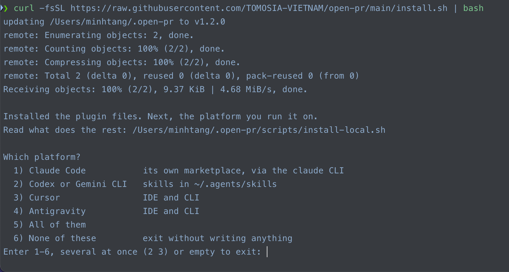
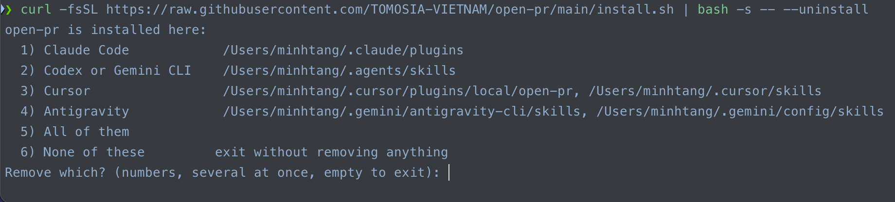

# 安装

[← README](../../README.zh-Hans.md)

需要 `git`、[`jq`](https://jqlang.org/)，以及 [`gh`](https://cli.github.com/)（GitHub）或 [`glab`](https://gitlab.com/gitlab-org/cli)（GitLab）—— 已安装并已登录。Bitbucket 没有官方 CLI：它从环境变量 `BITBUCKET_EMAIL` + `BITBUCKET_API_TOKEN` 读取 API token。无论哪种方式，评审都会以该账号的身份发布 —— 最小权限以及检查权限的命令见 [各平台如何取得 token](./credentials.md)。

## 安装

```bash
curl -fsSL https://raw.githubusercontent.com/TOMOSIA-VIETNAM/open-pr/main/install.sh | bash
```

[](../images/install.png)

或者：

| 平台 | 安装 | 使用 |
| -------- | ------- | --- |
| Claude Code | `/plugin marketplace add TOMOSIA-VIETNAM/open-pr`<br>`/plugin install open-pr@open-pr` | `/open-pr:review <PR_URL>` |
| Codex | `codex plugin marketplace add TOMOSIA-VIETNAM/open-pr`<br>`codex plugin add open-pr@open-pr` | `$open-pr-review <PR_URL>` |
| Gemini CLI | `gemini extensions install https://github.com/TOMOSIA-VIETNAM/open-pr --auto-update` | `/open-pr-review <PR_URL>` |
| Cursor | `curl -fsSL https://raw.githubusercontent.com/TOMOSIA-VIETNAM/open-pr/main/install.sh \| bash -s -- --platform cursor` | `/open-pr-review <PR_URL>` |
| Antigravity | `curl -fsSL https://raw.githubusercontent.com/TOMOSIA-VIETNAM/open-pr/main/install.sh \| bash -s -- --platform antigravity` | `/open-pr-review <PR_URL>` |

## 更新

```bash
curl -fsSL https://raw.githubusercontent.com/TOMOSIA-VIETNAM/open-pr/main/install.sh | bash -s -- --update
```

重新加载插件之后，如果新版本对 **schema** 改动较大，运行 `/open-pr:upgrade` 把该仓库的设置更新到最新。

## 卸载

```bash
curl -fsSL https://raw.githubusercontent.com/TOMOSIA-VIETNAM/open-pr/main/install.sh | bash -s -- --uninstall
```

[](../images/uninstall.png)

---

[重复评审 / fix 流程](./how-it-works.md) · [配置](./configuration.md)
